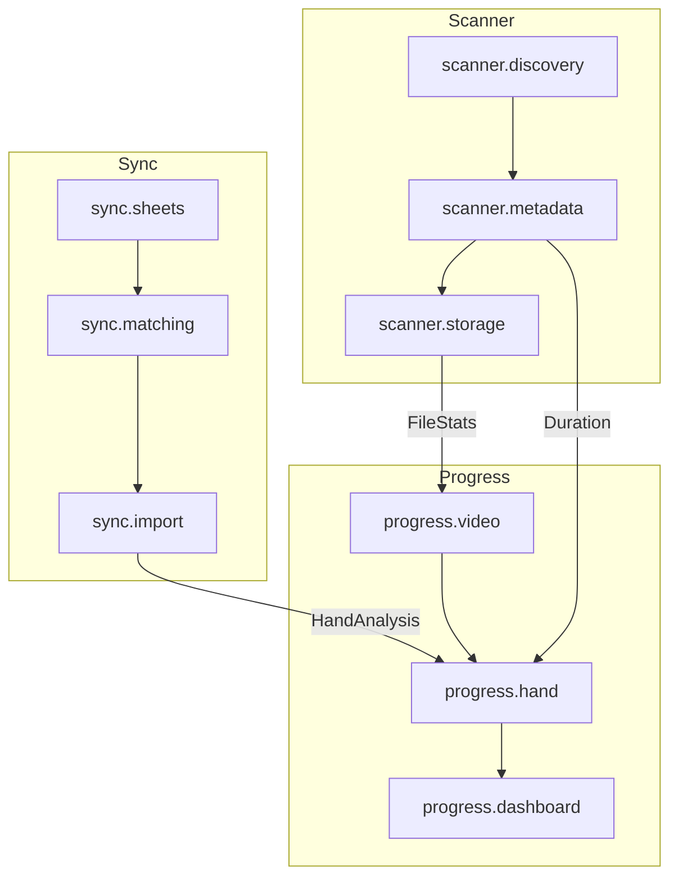

# Architecture: Block Agent System

**Version**: 2.0.0 | **Date**: 2025-12-11 | **Status**: Active

> **v2.0 변경사항**: Reconciliation Domain 추가 (NAS-Sheets 데이터 일관성 전담)

> Archive Statistics Dashboard를 위한 블럭화 + 에이전트 시스템 아키텍처

---

## 목차

1. [개요](#1-개요)
   - 1.1 목적
   - 1.2 설계 원칙
   - 1.3 아키텍처 개요
   - 1.4 AI 컨텍스트 최적화
2. [블럭 정의](#2-블럭-정의)
   - 2.1 블럭 구조
   - 2.2 도메인별 블럭 맵
   - 2.3 블럭 의존성 그래프
   - 2.4 블럭 사이즈 가이드
3. [에이전트 시스템](#3-에이전트-시스템)
   - 3.1 에이전트 계층 구조
   - 3.2 에이전트 인터페이스
   - 3.3 도메인 에이전트 상세
   - 3.4 에이전트-블럭 매핑 테이블
   - 3.5 Agent Rules 파일
4. [오케스트레이션 패턴](#4-오케스트레이션-패턴)
   - 4.1 워크플로우
   - 4.2 병렬 처리 패턴
5. [구현 가이드](#5-구현-가이드)

---

## 1. 개요

### 1.1 목적

| 목표 | 설명 |
|------|------|
| **로직 무결성** | 블럭 간 명확한 경계로 부작용(Side Effect) 격리 |
| **관리 최적화** | 블럭별 전담 에이전트로 책임 분리 |
| **확장성** | 새 블럭/에이전트 추가 시 기존 시스템 영향 최소화 |
| **디버깅 용이성** | 문제 발생 시 해당 블럭/에이전트만 분석 |

### 1.2 설계 원칙

```
┌─────────────────────────────────────────────────────────────┐
│                    DESIGN PRINCIPLES                         │
├─────────────────────────────────────────────────────────────┤
│  1. Single Responsibility  - 하나의 블럭은 하나의 관심사     │
│  2. Loose Coupling         - 블럭 간 인터페이스로만 통신     │
│  3. High Cohesion          - 블럭 내부는 강하게 결합        │
│  4. Fail Fast              - 에러는 즉시 감지, 빠르게 복구  │
│  5. Observable             - 모든 블럭 상태는 관찰 가능     │
└─────────────────────────────────────────────────────────────┘
```

### 1.3 아키텍처 개요

```
                         ┌─────────────────┐
                         │  Orchestrator   │
                         │     Agent       │
                         └────────┬────────┘
                                  │
           ┌──────────────┬──────────────┬──────────────┐
           │              │              │              │
           ▼              ▼              ▼              ▼
    ┌───────────┐  ┌───────────┐  ┌───────────┐  ┌─────────────┐
    │  Domain   │  │  Domain   │  │  Domain   │  │   Domain    │
    │  Agent    │  │  Agent    │  │  Agent    │  │   Agent     │
    │ (Scanner) │  │(Progress) │  │  (Sync)   │  │(Reconcile)  │
    └─────┬─────┘  └─────┬─────┘  └─────┬─────┘  └──────┬──────┘
          │              │              │               │
    ┌─────┴─────┐  ┌─────┴─────┐  ┌─────┴─────┐  ┌──────┴──────┐
    │  Blocks   │  │  Blocks   │  │  Blocks   │  │   Blocks    │
    ├───────────┤  ├───────────┤  ├───────────┤  ├─────────────┤
    │• Discovery│  │ • Video   │  │ • Sheets  │  │ • Matcher   │
    │• Metadata │  │ • Hand    │  │ • Matching│  │ • Aggregator│
    │• Storage  │  │• Dashboard│  │ • Import  │  │ • Validator │
    └───────────┘  └───────────┘  └───────────┘  └─────────────┘
```

### 1.4 AI 컨텍스트 최적화

#### 1.4.1 문제 진단

```
┌─────────────────────────────────────────────────────────────┐
│                    AI BOTTLENECKS                            │
├─────────────────────────────────────────────────────────────┤
│                                                              │
│  1. Context Pollution (컨텍스트 오염)                        │
│     ────────────────────────────────────────────────────     │
│     무관한 코드가 AI의 추론을 방해합니다.                     │
│     Scanner 작업 시 Dashboard 코드가 노이즈가 되어           │
│     환각(Hallucination)을 유발합니다.                        │
│                                                              │
│  2. Attention Dilution (주의력 분산)                         │
│     ────────────────────────────────────────────────────     │
│     입력량이 늘어날수록 AI의 '집중력'이 떨어집니다.          │
│     (Lost-in-the-Middle 현상)                                │
│                                                              │
│  3. Scale Threshold (규모 임계점)                            │
│     ────────────────────────────────────────────────────     │
│     파일 50개+ 규모부터 전체 분석 방식은 비효율적입니다.     │
│                                                              │
└─────────────────────────────────────────────────────────────┘
```

#### 1.4.2 블럭화 효과

| Before (단일 컨텍스트) | After (블럭화) |
|------------------------|----------------|
| 전체 코드베이스 로드 | 해당 블럭만 로드 (15~25 파일) |
| 무관한 코드로 인한 환각 | 관련 코드만 집중 분석 |
| AI 응답 시간 10초+ | AI 응답 시간 2~3초 |
| 오류율 높음 | 오류율 현저히 감소 |

---

## 2. 블럭 정의

### 2.1 블럭 구조

```python
# types/block.py
from typing import List, Optional
from dataclasses import dataclass
from enum import Enum

class DomainType(str, Enum):
    SCANNER = "scanner"      # NAS 스캔 도메인
    PROGRESS = "progress"    # 작업 진행률 도메인
    SYNC = "sync"            # Google Sheets 동기화 도메인

class BlockStatus(str, Enum):
    IDLE = "idle"
    PROCESSING = "processing"
    ERROR = "error"
    DISABLED = "disabled"

@dataclass
class Block:
    id: str                  # 'scanner.discovery', 'progress.video'
    domain: DomainType
    name: str                # 'discovery', 'video', 'sheets'
    version: str             # SemVer
    status: BlockStatus

    # 의존성
    inputs: List[str]        # 입력 포트
    outputs: List[str]       # 출력 포트

    # 메타데이터
    description: str
    owner: str               # 담당 에이전트 ID
    tags: List[str]
```

### 2.2 도메인별 블럭 맵

#### Scanner Domain (NAS 스캔)

```
┌─────────────────────────────────────────────────────────────┐
│                    SCANNER DOMAIN                            │
├─────────────────────────────────────────────────────────────┤
│                                                              │
│  ┌──────────────┐    ┌──────────────┐    ┌──────────────┐  │
│  │  discovery   │───▶│   metadata   │───▶│   storage    │  │
│  │    Block     │    │    Block     │    │    Block     │  │
│  └──────────────┘    └──────────────┘    └──────────────┘  │
│         │                   │                   │          │
│         ▼                   ▼                   ▼          │
│  • NAS 디렉토리 탐색   • ffprobe 실행       • DB 저장      │
│  • 파일 필터링         • Duration 추출      • 캐시 관리    │
│  • 권한 검증           • MIME 타입 분석     • 인덱싱       │
│                                                              │
└─────────────────────────────────────────────────────────────┘
```

| Block ID | 책임 | 입력 | 출력 |
|----------|------|------|------|
| `scanner.discovery` | NAS 디렉토리 스캔 | `ScanRequest` | `FileEntry[]` |
| `scanner.metadata` | 미디어 메타데이터 추출 | `FileEntry` | `MediaMetadata` |
| `scanner.storage` | DB 저장 및 캐시 | `MediaMetadata` | `FileStats` |

**파일 매핑:**
```
backend/app/
├── api/
│   ├── scan.py              → scanner.discovery
│   └── folders.py           → scanner.discovery
├── services/
│   ├── scanner.py           → scanner.metadata
│   └── utils.py             → scanner.metadata
└── models/
    └── file_stats.py        → scanner.storage
```

#### Progress Domain (작업 진행률)

```
┌─────────────────────────────────────────────────────────────┐
│                    PROGRESS DOMAIN                           │
├─────────────────────────────────────────────────────────────┤
│                                                              │
│  ┌──────────────┐    ┌──────────────┐    ┌──────────────┐  │
│  │    video     │───▶│     hand     │───▶│  dashboard   │  │
│  │    Block     │    │    Block     │    │    Block     │  │
│  └──────────────┘    └──────────────┘    └──────────────┘  │
│         │                   │                   │          │
│         ▼                   ▼                   ▼          │
│  • Video 메타데이터    • Hand 분석 관리     • 통계 집계    │
│  • Duration 관리       • 90% 완료 계산      • 시각화 데이터│
│  • 상태 분류           • Timecode 처리      • 필터링       │
│                                                              │
└─────────────────────────────────────────────────────────────┘
```

| Block ID | 책임 | 입력 | 출력 |
|----------|------|------|------|
| `progress.video` | 비디오 파일 관리 | `VideoQuery` | `VideoFile[]` |
| `progress.hand` | 핸드 분석 결과 처리 | `VideoFileId` | `HandAnalysis[]` |
| `progress.dashboard` | 대시보드 통계 집계 | `DashboardQuery` | `Statistics` |

**파일 매핑:**
```
backend/app/
├── api/
│   ├── stats.py             → progress.dashboard
│   └── work_status.py       → progress.video
├── models/
│   └── work_status.py       → progress.hand
└── schemas/
    ├── stats.py             → progress.dashboard
    └── work_status.py       → progress.video
```

**핵심 로직 - 90% 완료 기준:**
```python
# progress.hand 블럭의 핵심 로직
def calculate_completion_status(video_duration: float, hands: List[Hand]) -> str:
    """
    90% 완료 기준:
    MAX(time_end) >= video_duration × 0.9
    """
    if not hands:
        return "NOT_STARTED"

    max_time_end = max(h.timecode_out_sec for h in hands)
    progress = max_time_end / video_duration if video_duration > 0 else 0

    if progress >= 0.9:
        return "COMPLETE"
    elif progress >= 0.1:
        return "IN_PROGRESS"
    elif progress > 0:
        return "STARTED"
    else:
        return "NOT_STARTED"
```

#### Sync Domain (Google Sheets 동기화)

```
┌─────────────────────────────────────────────────────────────┐
│                      SYNC DOMAIN                             │
├─────────────────────────────────────────────────────────────┤
│                                                              │
│  ┌──────────────┐    ┌──────────────┐    ┌──────────────┐  │
│  │    sheets    │───▶│   matching   │───▶│    import    │  │
│  │    Block     │    │    Block     │    │    Block     │  │
│  └──────────────┘    └──────────────┘    └──────────────┘  │
│         │                   │                   │          │
│         ▼                   ▼                   ▼          │
│  • Sheets API 연동     • 파일명 매칭        • DB Import   │
│  • CSV 파싱            • Fuzzy 매칭         • 중복 처리   │
│  • 데이터 정규화       • 경로 해석          • 갱신 전략   │
│                                                              │
└─────────────────────────────────────────────────────────────┘
```

| Block ID | 책임 | 입력 | 출력 |
|----------|------|------|------|
| `sync.sheets` | Google Sheets 연동 | `SheetId` | `RawSheetData` |
| `sync.matching` | NAS 파일과 시트 데이터 매칭 | `RawSheetData` | `MatchedRecords` |
| `sync.import` | 매칭된 데이터 DB 저장 | `MatchedRecords` | `ImportResult` |

#### Reconciliation Domain (NAS-Sheets 데이터 일관성) - **NEW v2.0**

```
┌─────────────────────────────────────────────────────────────┐
│                  RECONCILIATION DOMAIN                       │
├─────────────────────────────────────────────────────────────┤
│                                                              │
│  "NAS 데이터와 Google Sheets 데이터의 일관성 보장 전문가"    │
│                                                              │
│  ┌──────────────┐    ┌──────────────┐    ┌──────────────┐  │
│  │   recon.     │───▶│   recon.     │───▶│   recon.     │  │
│  │   matcher    │    │  aggregator  │    │   validator  │  │
│  │    Block     │    │    Block     │    │    Block     │  │
│  └──────────────┘    └──────────────┘    └──────────────┘  │
│         │                   │                   │          │
│         ▼                   ▼                   ▼          │
│  • 폴더-카테고리 매칭   • 계층 합산 로직     • 불일치 감지  │
│  • 6가지 전략 관리     • Cascading 방지     • 검증 규칙    │
│  • 점수 계산          • file_count 집계     • 경고 생성    │
│                                                              │
└─────────────────────────────────────────────────────────────┘
```

| Block ID | 책임 | 입력 | 출력 |
|----------|------|------|------|
| `recon.matcher` | 폴더명-카테고리 매칭 (6가지 전략) | `FolderName, WorkStatuses` | `MatchResult` |
| `recon.aggregator` | 계층 합산, Cascading 방지 | `Children, ParentIds` | `AggregatedSummary` |
| `recon.validator` | 불일치 감지, 검증 | `FolderData` | `ValidationResult` |

**핵심 문제 해결:**
| 문제 | 블럭 | 해결 방법 |
|------|------|----------|
| NAS file_count 불일치 | `recon.aggregator` | work_summary 없는 자식도 file_count 합산 |
| Cascading Match | `recon.aggregator` | parent_work_status_ids 전파 |
| 중복 excel_done | `recon.matcher` | 최고 점수 1개만 반환 |
| 데이터 소스 불일치 | `recon.validator` | 10% 이상 차이 시 경고 |

**현재 코드 위치** (리팩토링 전):
- `backend/app/services/progress_service.py:202-293` → `recon.matcher`
- `backend/app/services/progress_service.py:569-665` → `recon.aggregator`
- `backend/app/services/progress_service.py:628-630` → `recon.validator`

**상세 규칙**: `.claude/agents/reconciliation-domain.md`

### 2.3 블럭 의존성 그래프



### 2.4 블럭 사이즈 가이드

#### 사이즈 기준표

| 구분 | 판단 기준 | 위험 신호 |
|------|----------|-----------|
| **물리적 크기** | 파일 15~25개 / 20k~40k 토큰 | AI "Thinking" 시간 10초+ |
| **논리적 범위** | 단일 책임 원칙 (SRP) | 설명이 두 문장 이상 필요 |
| **독립성** | Self-Contained (자체 완결성) | 수정 시 다른 폴더 파일 열어야 함 |
| **테스트 용이성** | 블럭 단독 테스트 가능 | Mock이 5개 이상 필요 |

#### Archive Statistics 블럭별 현황

| 블럭 | 파일 수 | 예상 토큰 | 상태 |
|------|---------|----------|------|
| `scanner` | 8개 | ~20k | 적정 |
| `progress` | 6개 | ~15k | 적정 |
| `sync` | 4개 (예정) | ~12k | 적정 |

---

## 3. 에이전트 시스템

### 3.1 에이전트 계층 구조

```
┌─────────────────────────────────────────────────────────────┐
│                    AGENT HIERARCHY                           │
├─────────────────────────────────────────────────────────────┤
│                                                              │
│  Level 0: Orchestrator                                       │
│  ┌─────────────────────────────────────────────────────┐    │
│  │              OrchestratorAgent                       │    │
│  │  • 전체 워크플로우 조정                              │    │
│  │  • 도메인 에이전트 스케줄링                          │    │
│  │  • 글로벌 에러 핸들링                               │    │
│  └─────────────────────────────────────────────────────┘    │
│                            │                                 │
│  Level 1: Domain Agents    │                                 │
│  ┌──────────┬──────────┬──────────┐                        │
│  │ Scanner  │ Progress │   Sync   │                        │
│  │  Agent   │  Agent   │  Agent   │                        │
│  └────┬─────┴────┬─────┴────┬─────┘                        │
│       │          │          │                               │
│  Level 2: Block Agents                                       │
│  ┌────┴────┐┌────┴────┐┌────┴────┐                        │
│  │discovery││ video   ││ sheets  │                        │
│  │metadata ││ hand    ││matching │                        │
│  │storage  ││dashboard││ import  │                        │
│  └─────────┘└─────────┘└─────────┘                        │
│                                                              │
└─────────────────────────────────────────────────────────────┘
```

### 3.2 에이전트 인터페이스

```python
# types/agent.py
from typing import List, Any, Optional
from dataclasses import dataclass
from enum import Enum
from abc import ABC, abstractmethod

class AgentLevel(str, Enum):
    ORCHESTRATOR = "orchestrator"
    DOMAIN = "domain"
    BLOCK = "block"

class AgentStatus(str, Enum):
    IDLE = "idle"
    BUSY = "busy"
    ERROR = "error"
    STOPPED = "stopped"

class TaskType(str, Enum):
    QUERY = "query"        # 데이터 조회
    MUTATION = "mutation"  # 데이터 변경
    BATCH = "batch"        # 배치 처리
    MONITOR = "monitor"    # 상태 감시

class Priority(str, Enum):
    CRITICAL = "critical"
    HIGH = "high"
    NORMAL = "normal"
    LOW = "low"

@dataclass
class Task:
    id: str
    type: TaskType
    priority: Priority
    payload: Any
    timeout: int
    max_retries: int = 3

@dataclass
class TaskResult:
    task_id: str
    success: bool
    data: Optional[Any] = None
    error: Optional[str] = None

class Agent(ABC):
    id: str
    level: AgentLevel
    status: AgentStatus
    managed_blocks: List[str]
    child_agents: List[str]

    @abstractmethod
    async def execute(self, task: Task) -> TaskResult:
        pass

    @abstractmethod
    async def start(self) -> None:
        pass

    @abstractmethod
    async def stop(self) -> None:
        pass

    @abstractmethod
    async def health_check(self) -> dict:
        pass
```

### 3.3 도메인 에이전트 상세

#### ScannerDomainAgent

```python
# agents/scanner_domain_agent.py

class ScannerDomainAgent(Agent):
    id = "scanner-domain"
    level = AgentLevel.DOMAIN

    managed_blocks = [
        "scanner.discovery",
        "scanner.metadata",
        "scanner.storage"
    ]

    capabilities = [
        {
            "name": "scan_directory",
            "description": "NAS 디렉토리 스캔",
            "input": "ScanRequest",
            "output": "ScanResult"
        },
        {
            "name": "get_file_stats",
            "description": "파일 통계 조회",
            "input": "FileQuery",
            "output": "FileStats[]"
        },
        {
            "name": "get_folder_stats",
            "description": "폴더 통계 조회",
            "input": "FolderQuery",
            "output": "FolderStats"
        }
    ]
```

#### ProgressDomainAgent

```python
# agents/progress_domain_agent.py

class ProgressDomainAgent(Agent):
    id = "progress-domain"
    level = AgentLevel.DOMAIN

    managed_blocks = [
        "progress.video",
        "progress.hand",
        "progress.dashboard"
    ]

    capabilities = [
        {
            "name": "get_video_progress",
            "description": "비디오 작업 진행률 조회",
            "input": "VideoQuery",
            "output": "VideoProgress"
        },
        {
            "name": "calculate_completion",
            "description": "90% 완료 상태 계산",
            "input": "VideoFileId",
            "output": "CompletionStatus"
        },
        {
            "name": "get_dashboard_stats",
            "description": "대시보드 통계 집계",
            "input": "DashboardQuery",
            "output": "DashboardStats"
        }
    ]
```

#### SyncDomainAgent

```python
# agents/sync_domain_agent.py

class SyncDomainAgent(Agent):
    id = "sync-domain"
    level = AgentLevel.DOMAIN

    managed_blocks = [
        "sync.sheets",
        "sync.matching",
        "sync.import"
    ]

    capabilities = [
        {
            "name": "fetch_sheet_data",
            "description": "Google Sheets 데이터 가져오기",
            "input": "SheetConfig",
            "output": "RawSheetData"
        },
        {
            "name": "match_files",
            "description": "시트 데이터와 NAS 파일 매칭",
            "input": "MatchRequest",
            "output": "MatchResult"
        },
        {
            "name": "import_hands",
            "description": "핸드 분석 결과 가져오기",
            "input": "ImportRequest",
            "output": "ImportResult"
        }
    ]
```

### 3.4 에이전트-블럭 매핑 테이블

| Agent ID | Level | Managed Blocks | 주요 책임 |
|----------|-------|----------------|-----------|
| `orchestrator` | 0 | - | 전역 조정, 에러 처리 |
| `scanner-domain` | 1 | `scanner.*` (3개) | NAS 스캔 전체 |
| `progress-domain` | 1 | `progress.*` (3개) | 작업 진행률 전체 |
| `sync-domain` | 1 | `sync.*` (3개) | Sheets 동기화 전체 |
| `scanner.discovery` | 2 | 단일 블럭 | 디렉토리 탐색 |
| `scanner.metadata` | 2 | 단일 블럭 | 미디어 메타데이터 |
| `scanner.storage` | 2 | 단일 블럭 | DB 저장 |
| `progress.video` | 2 | 단일 블럭 | 비디오 관리 |
| `progress.hand` | 2 | 단일 블럭 | 핸드 분석 |
| `progress.dashboard` | 2 | 단일 블럭 | 대시보드 통계 |

### 3.5 Agent Rules 파일

#### 파일 구조

```
archive-statistics/
├── .claude/
│   └── agents/
│       ├── orchestrator.md           # 오케스트레이터 규칙
│       ├── scanner-domain.md         # Scanner 도메인 규칙
│       ├── progress-domain.md        # Progress 도메인 규칙
│       └── sync-domain.md            # Sync 도메인 규칙
│
└── backend/app/
    ├── api/
    │   └── AGENT_RULES.md            # API 블럭 규칙
    ├── services/
    │   └── AGENT_RULES.md            # Services 블럭 규칙
    └── models/
        └── AGENT_RULES.md            # Models 블럭 규칙
```

#### Agent Rules 템플릿

```markdown
<!-- backend/app/services/AGENT_RULES.md -->

# Scanner Services Block Agent Rules

## Identity
- **Role**: NAS 스캔 및 메타데이터 추출 전문가
- **Domain**: Scanner
- **Scope**: `backend/app/services/` 내부만

## Constraints (제약 사항)

### DO (해야 할 것)
- 이 폴더 내 파일만 수정
- `scanner.py`의 ArchiveScanner 클래스 구조 유지
- ffprobe 호출 시 timeout 설정 필수
- 대용량 스캔 시 batch commit 사용

### DON'T (하지 말 것)
- `api/` 폴더 직접 수정
- DB 스키마 변경
- 동기 blocking 호출 (asyncio 사용 필수)
- 하드코딩된 경로 사용 (settings 통해서만)

## Dependencies (의존성)

### 내부 의존성
- `app.core.config`: 설정 값
- `app.models.file_stats`: DB 모델

### 외부 의존성
- `ffprobe`: 미디어 메타데이터 추출
- `sqlalchemy`: DB 접근

## Testing
- 단위 테스트: `tests/test_scanner.py`
- Mock: NAS 접근, ffprobe 호출만 Mock 허용

## Error Codes
- `SCAN_PERMISSION_DENIED`
- `SCAN_PATH_NOT_FOUND`
- `METADATA_EXTRACTION_FAILED`
- `STORAGE_COMMIT_FAILED`
```

---

## 4. 오케스트레이션 패턴

### 4.1 워크플로우

#### Full Scan 워크플로우

```
                    ┌────────────────────┐
                    │   Start Full Scan  │
                    └─────────┬──────────┘
                              │
                    ┌─────────▼──────────┐
                    │  scanner.discovery │
                    │  (NAS 디렉토리 탐색) │
                    └─────────┬──────────┘
                              │
                    ┌─────────▼──────────┐
                    │  scanner.metadata  │
                    │  (Duration 추출)    │
                    └─────────┬──────────┘
                              │
                    ┌─────────▼──────────┐
                    │   scanner.storage  │
                    │   (DB 저장)         │
                    └─────────┬──────────┘
                              │
                    ┌─────────▼──────────┐
                    │   Scan Complete    │
                    └────────────────────┘
```

#### Progress Update 워크플로우

```
                    ┌────────────────────┐
                    │  Sheets Updated    │
                    └─────────┬──────────┘
                              │
                    ┌─────────▼──────────┐
                    │    sync.sheets     │
                    │   (데이터 가져오기)  │
                    └─────────┬──────────┘
                              │
                    ┌─────────▼──────────┐
                    │   sync.matching    │
                    │  (파일 매칭)        │
                    └─────────┬──────────┘
                              │
                    ┌─────────▼──────────┐
                    │    sync.import     │
                    │   (Hand 저장)       │
                    └─────────┬──────────┘
                              │
         ┌────────────────────┼────────────────────┐
         │                    │                    │
         ▼                    ▼                    ▼
┌─────────────────┐ ┌─────────────────┐ ┌─────────────────┐
│  progress.video │ │  progress.hand  │ │progress.dashboard│
│  (상태 갱신)     │ │  (90% 계산)     │ │  (통계 집계)     │
└─────────────────┘ └─────────────────┘ └─────────────────┘
```

### 4.2 병렬 처리 패턴

```python
# 병렬 처리 예시
async def parallel_scan(paths: List[str]):
    """여러 경로를 병렬로 스캔"""
    tasks = [
        scanner_agent.execute(Task(
            id=f"scan-{i}",
            type=TaskType.BATCH,
            priority=Priority.NORMAL,
            payload={"path": path},
            timeout=600
        ))
        for i, path in enumerate(paths)
    ]

    results = await asyncio.gather(*tasks, return_exceptions=True)
    return results
```

---

## 5. 구현 가이드

### 5.1 단계별 적용

| 단계 | 작업 | 우선순위 |
|------|------|----------|
| 1 | 기존 코드를 도메인 경계에 맞게 폴더 재구성 | High |
| 2 | 각 블럭에 `AGENT_RULES.md` 생성 | High |
| 3 | `.claude/agents/` 도메인 에이전트 규칙 작성 | Medium |
| 4 | 블럭 간 인터페이스 정의 (`types.py`) | Medium |
| 5 | 에이전트 계층 구현 | Low |

### 5.2 현재 구조 → 블럭 구조 매핑

```
현재 구조:                         블럭 구조:
backend/app/                      backend/app/
├── api/                          ├── blocks/
│   ├── scan.py         ──────▶  │   ├── scanner/
│   ├── folders.py               │   │   ├── discovery.py
│   ├── stats.py                 │   │   ├── metadata.py
│   └── work_status.py           │   │   ├── storage.py
├── services/                    │   │   └── AGENT_RULES.md
│   ├── scanner.py      ──────▶  │   ├── progress/
│   └── utils.py                 │   │   ├── video.py
├── models/                      │   │   ├── hand.py
│   ├── file_stats.py   ──────▶  │   │   ├── dashboard.py
│   └── work_status.py           │   │   └── AGENT_RULES.md
└── schemas/                     │   └── sync/
    ├── scan.py                  │       ├── sheets.py
    ├── stats.py                 │       ├── matching.py
    └── work_status.py           │       ├── import.py
                                 │       └── AGENT_RULES.md
                                 ├── shared/
                                 │   ├── types.py
                                 │   └── utils.py
                                 └── api/
                                     └── routes.py
```

### 5.3 점진적 마이그레이션 전략

1. **Phase 1**: AGENT_RULES.md 파일만 먼저 생성 (코드 변경 없음)
2. **Phase 2**: 타입 정의 분리 (`types.py`)
3. **Phase 3**: 새 기능은 블럭 구조로 개발
4. **Phase 4**: 기존 코드 점진적 리팩토링

---

## 참조

| 문서 | 설명 |
|------|------|
| [VIDEO_COMPLETION_SPEC.md](./VIDEO_COMPLETION_SPEC.md) | 90% 완료 기준 설계 |
| [REAL_DATA_ANALYSIS_RESULT.md](./REAL_DATA_ANALYSIS_RESULT.md) | 실데이터 분석 결과 |
| wsoptv/0001-block-agent-system.md | 참조 아키텍처 |
