# NAS 폴더 계산 로직 분석

**Version**: 1.0.0 | **Date**: 2025-12-13 | **Status**: Issue Analysis

이 문서는 NAS 폴더 통계 계산 로직을 분석하고, 현재 발견된 문제점과 개선 방안을 제시합니다.

---

## 1. 전체 아키텍처

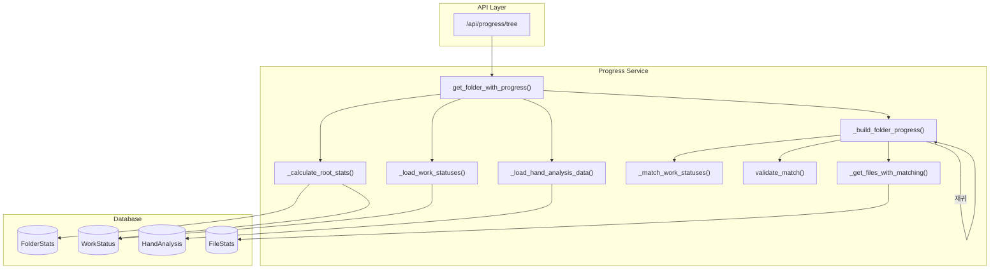

---

## 2. 데이터 소스별 통계 계산 방식

### 2.1 데이터 소스 개요

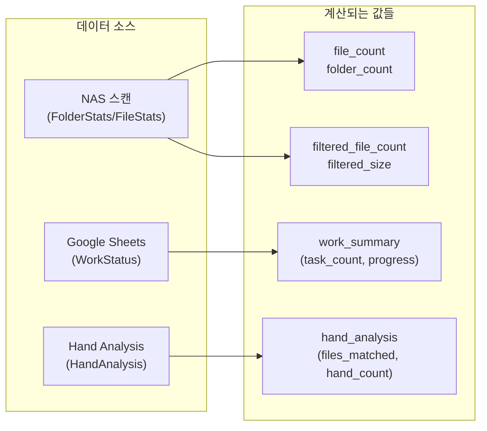

### 2.2 각 통계 값의 계산 방식

| 값 | 소스 | 계산 방식 | 하위 폴더 포함 |
|----|------|----------|---------------|
| `file_count` | FolderStats | DB에 저장된 값 | ✅ 포함 (스캔 시 계산) |
| `folder_count` | FolderStats | DB에 저장된 값 | ✅ 포함 |
| `filtered_file_count` | FileStats | DB 쿼리로 집계 | ✅ `startswith(folder.path)` |
| `filtered_size` | FileStats | DB 쿼리로 집계 | ✅ `startswith(folder.path)` |
| `work_summary.total_done` | WorkStatus | 직접 매칭만 합산 | ❌ 자식 합산 안함 |
| `hand_analysis.files_matched` | HandAnalysis | 직접 + 자식 합산 | ✅ 재귀 합산 |
| `hand_analysis.hand_count` | HandAnalysis | 직접 + 자식 합산 | ✅ 재귀 합산 |

---

## 3. filtered_file_count 계산 흐름

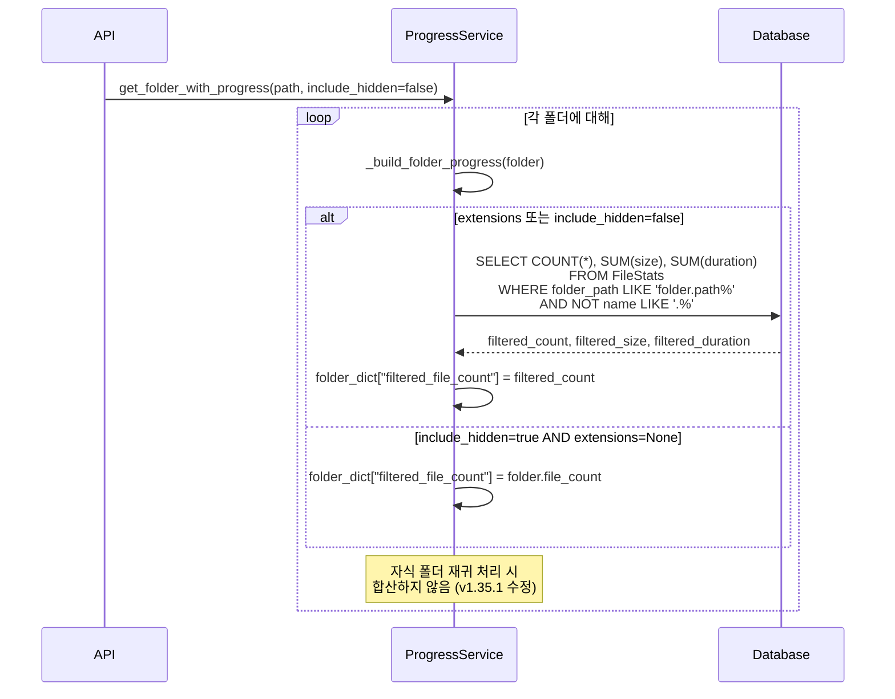

### 3.1 현재 로직 (v1.35.1)

```python
# progress_service.py:697-729
if extensions or not include_hidden:
    filtered_query = (
        select(
            func.count(FileStats.id).label("count"),
            func.coalesce(func.sum(FileStats.size), 0).label("total_size"),
            func.coalesce(func.sum(FileStats.duration), 0).label("total_duration"),
        )
        .where(FileStats.folder_path.startswith(folder.path))  # ⚠️ 하위 폴더 포함
    )
    if extensions:
        filtered_query = filtered_query.where(FileStats.extension.in_(extensions))
    if not include_hidden:
        filtered_query = filtered_query.where(~FileStats.name.startswith('.'))
```

**핵심 포인트**:
- `folder_path.startswith(folder.path)`로 **하위 폴더의 모든 파일 포함**
- 자식 폴더에서 다시 집계하면 **중복 집계 발생**

---

## 4. 문제 분석: 서브 폴더마다 합산 값이 다른 현상

### 4.1 문제 시나리오

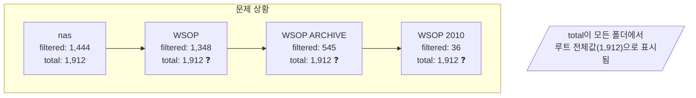

### 4.2 근본 원인

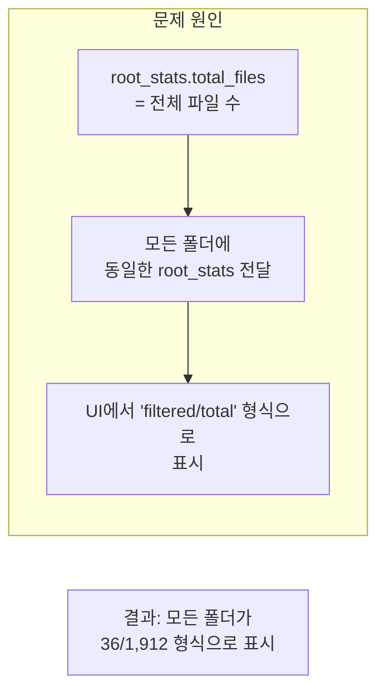

**문제 코드 위치**:

1. **root_stats 계산** (`progress_service.py:190-260`):
   - 전체 ARCHIVE의 파일 수를 계산
   - 모든 폴더에 동일한 값 전달

2. **folder_dict에 root_stats 설정** (`progress_service.py:731-752`):
   ```python
   folder_dict["root_stats"] = {
       "total_files": root_total_files,  # 전체 루트 파일 수
       "total_size": root_total_size,
       ...
   }
   ```

3. **프론트엔드 표시** (`MasterFolderTree/index.tsx:331-341`):
   ```jsx
   {folder.root_stats ? (
       <>
           <span>{folder.filtered_file_count}</span>
           /{folder.root_stats.total_files}  // ← 모든 폴더에서 동일한 값
       </>
   )}
   ```

---

## 5. 통계 값들의 관계 다이어그램

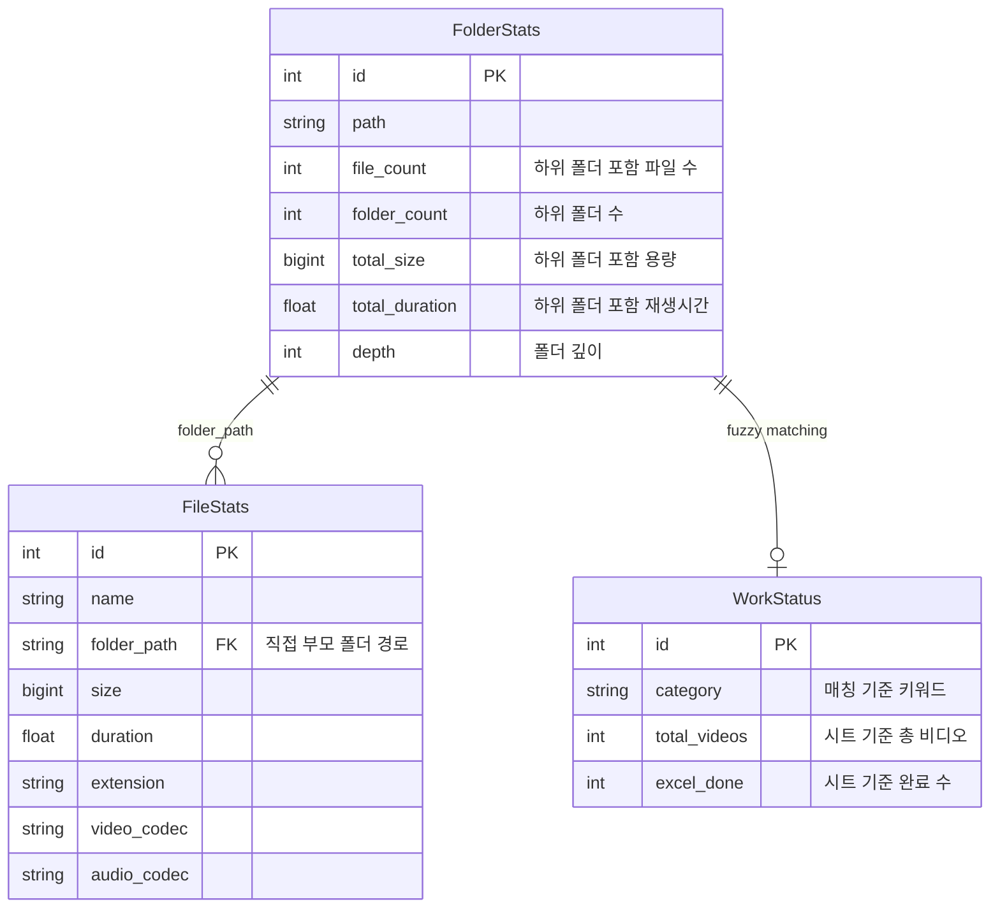

---

## 6. 계산 흐름 상세

### 6.1 filtered_* 계산

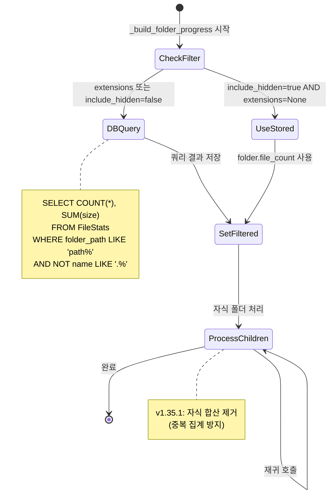

### 6.2 work_summary 계산

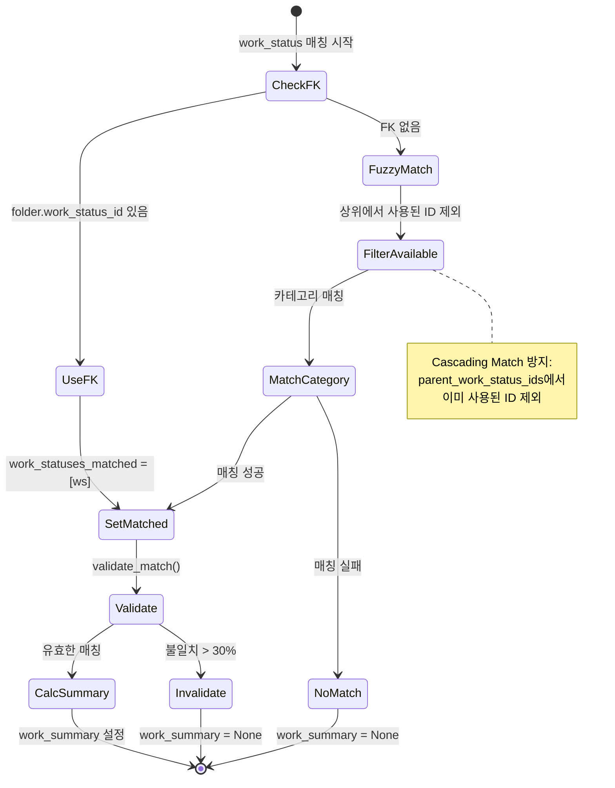

---

## 7. 문제점 및 개선 방안

### 7.1 현재 문제점

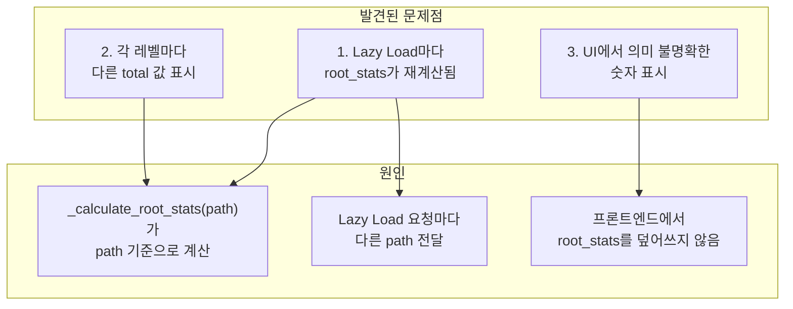

### 7.2 Lazy Load와 root_stats 불일치 분석

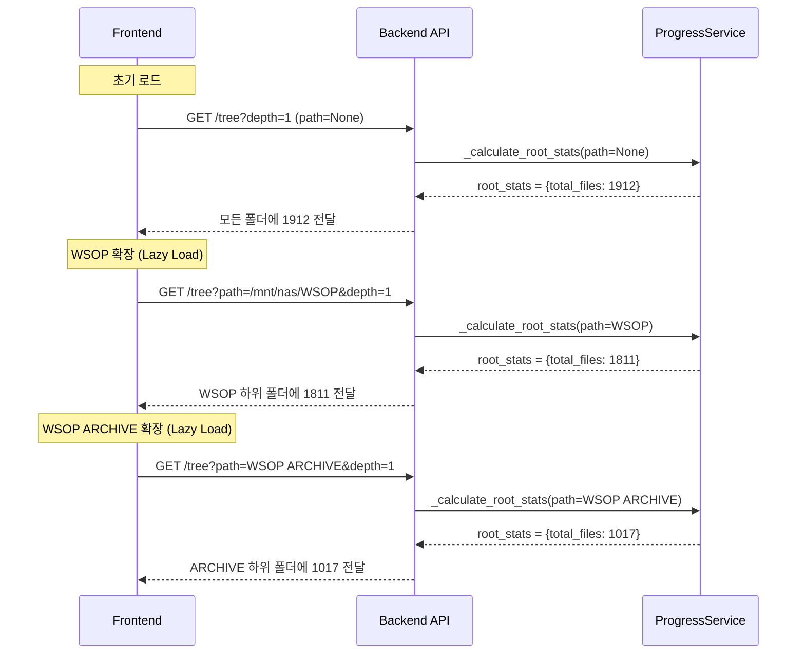

### 7.3 실제 데이터 예시

| 로드 단계 | API path | root_stats.total_files | UI 표시 |
|----------|----------|------------------------|---------|
| 초기 | None | **1912** | nas: 1,444/1,912 |
| Lazy 1 | /mnt/nas/WSOP | **1811** | WSOP: 1,348/1,811 |
| Lazy 2 | WSOP ARCHIVE | **1017** | ARCHIVE: 545/1,017 |
| Lazy 3 | WSOP 2010 | **72** | 2010: 36/72 |

### 7.4 개선 방안

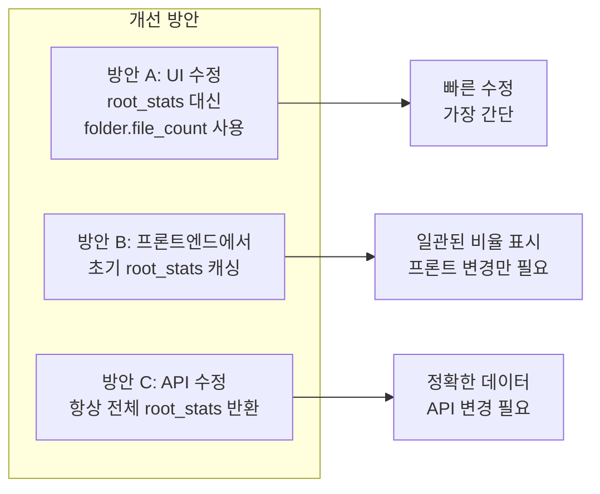

### 7.5 방안별 상세 설명

#### 방안 A: UI에서 folder.file_count 사용 (권장)
- **변경**: `root_stats.total_files` 대신 `folder.file_count` 사용
- **장점**: 즉시 적용 가능, 각 폴더의 실제 파일 수 표시
- **단점**: 전체 대비 비율 표시 불가

#### 방안 B: 프론트엔드에서 초기 root_stats 캐싱
- **변경**: 초기 로드 시 root_stats를 상태로 저장, lazy load 결과에 적용
- **장점**: 일관된 비율 표시
- **단점**: 상태 관리 복잡도 증가

#### 방안 C: API에서 항상 전체 root_stats 반환
- **변경**: `_calculate_root_stats(path=None)` 항상 사용
- **장점**: 모든 폴더에서 일관된 전체 대비 비율
- **단점**: API 응답 의미 변경, 기존 동작 변경

---

## 8. 권장 해결 방안

### 8.1 즉시 적용 가능한 수정 (방안 A)

**위치**: `frontend/src/components/MasterFolderTree/index.tsx:331-355`

**현재 코드**:
```jsx
{folder.root_stats ? (
    <>
        <span>{folder.filtered_file_count}</span>
        /{folder.root_stats.total_files}  // ← 문제: 루트 전체 파일 수
    </>
) : (
    <>
        <span>{folder.filtered_file_count}</span>
        {' files'}
    </>
)}
```

**수정 제안**:
```jsx
{folder.root_stats ? (
    <>
        <span className={folder.filtered_file_count !== folder.file_count ? 'text-blue-600' : ''}>
            {folder.filtered_file_count?.toLocaleString()}
        </span>
        /{folder.file_count.toLocaleString()}  // ← 수정: 폴더 자체 파일 수
        <span className="text-gray-300 mx-1">·</span>
        <span className="text-gray-400">
            ({((folder.file_count / folder.root_stats.total_files) * 100).toFixed(1)}%)
        </span>
    </>
)}
```

### 8.2 표시 형식 예시

| 현재 | 개선 후 |
|------|---------|
| 36/1,912 또는 36/1,017 또는 36/72 (불일치) | 36/72 files (필터링/폴더전체) |
| 1,348/1,811 (lazy load 기준) | 1,348/1,912 files (70.4% of archive) |

---

## 9. 문제 요약

### 두 가지 문제점

1. **Lazy Load마다 root_stats 재계산**
   - 초기: 1912 (전체)
   - WSOP: 1811 (WSOP 기준)
   - ARCHIVE: 1017 (ARCHIVE 기준)
   - 결과: 같은 트리에서 다른 total 표시

2. **root_stats.total_files의 의미 혼란**
   - 설계 의도: 전체 대비 비율 표시
   - 실제 사용: filtered/total 형식 표시
   - 결과: 의미 불명확한 숫자

### 핵심 코드 위치

| 파일 | 라인 | 설명 |
|------|------|------|
| `progress_service.py` | 128 | root_stats 계산 호출 |
| `progress_service.py` | 190-260 | `_calculate_root_stats()` - path별 계산 |
| `progress_service.py` | 731-752 | folder_dict에 root_stats 설정 |
| `MasterFolderTree/index.tsx` | 331-355 | UI 표시 로직 |

---

## 10. 참조

- **핵심 파일**: `backend/app/services/progress_service.py`
- **Block Index**: 파일 상단 주석 참조
- **관련 Issue**: #29 (NAS/Sheets 데이터 분리 표시)
- **관련 PRD**: PRD-0041 (매칭 검증)

---

## 변경 이력

| 버전 | 날짜 | 변경 |
|------|------|------|
| 1.1.0 | 2025-12-13 | Lazy Load root_stats 불일치 문제 분석 추가 |
| 1.0.0 | 2025-12-13 | 초기 문서 작성 (Issue 분석용) |
