# PRD-0040: Archiving Status UI 개선

**Version**: 1.1.0
**Created**: 2025-12-12
**Issue**: #40
**Status**: Draft

---

## 1. Overview

### 1.1 Background

Issue #37에서 `WorkStatus` → `ArchivingStatus` 이름 변경이 완료되었습니다. 이제 UI에서 **작업자 표기** 및 **작업 상태**를 더 직관적으로 확인할 수 있도록 개선합니다.

### 1.2 Goals

1. **Work Status 탭 강화**: 핵심 작업 현황 뷰
2. **대시보드 통합**: 메인 대시보드에서 작업 현황 요약 확인
3. **Block Agent 설계**: AI 컨텍스트 최적화를 위한 도메인 분리
4. **API 마이그레이션**: deprecated API → 새 API 적용

---

## 2. UI Mockup Design

### 2.1 전체 페이지 레이아웃

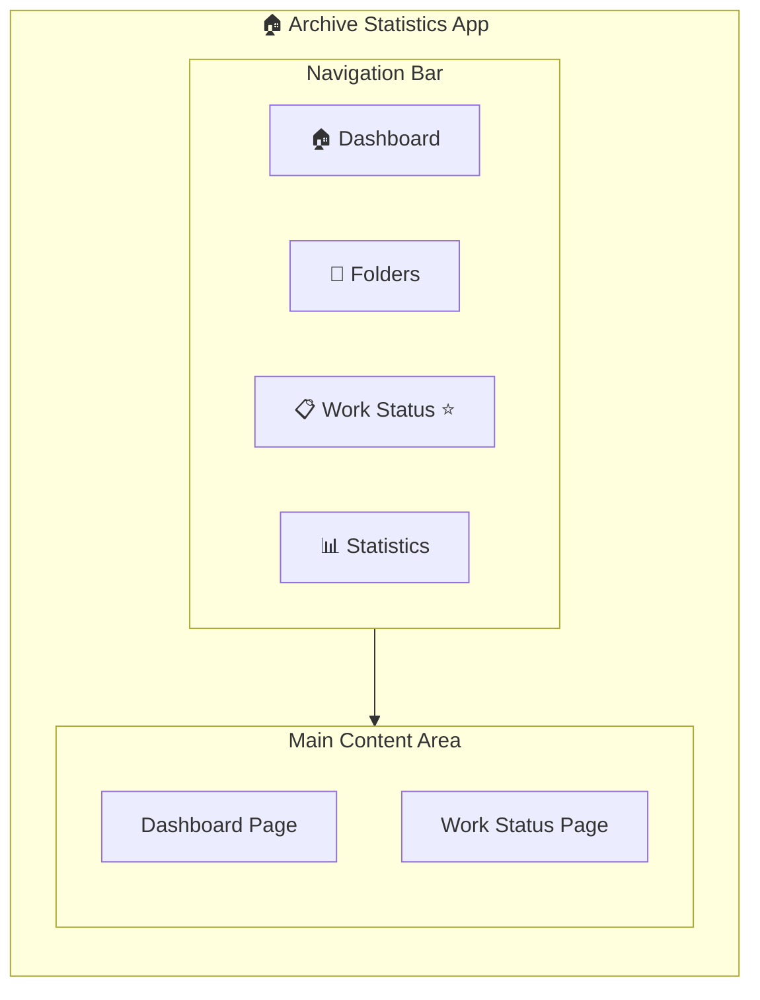

### 2.2 Work Status Page - 전체 구조

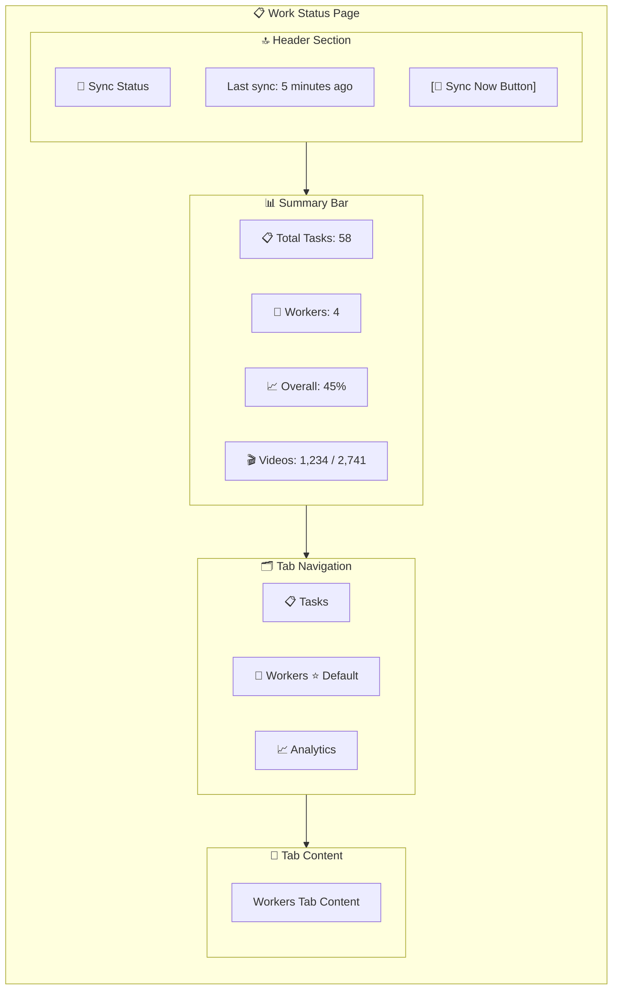

### 2.3 Workers Tab - 작업자 카드 그리드

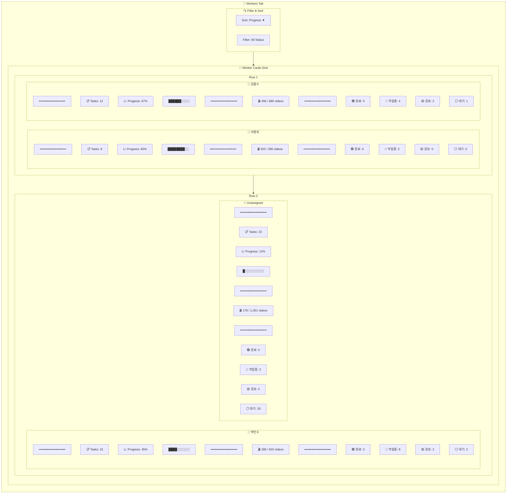

### 2.4 Worker Detail Modal

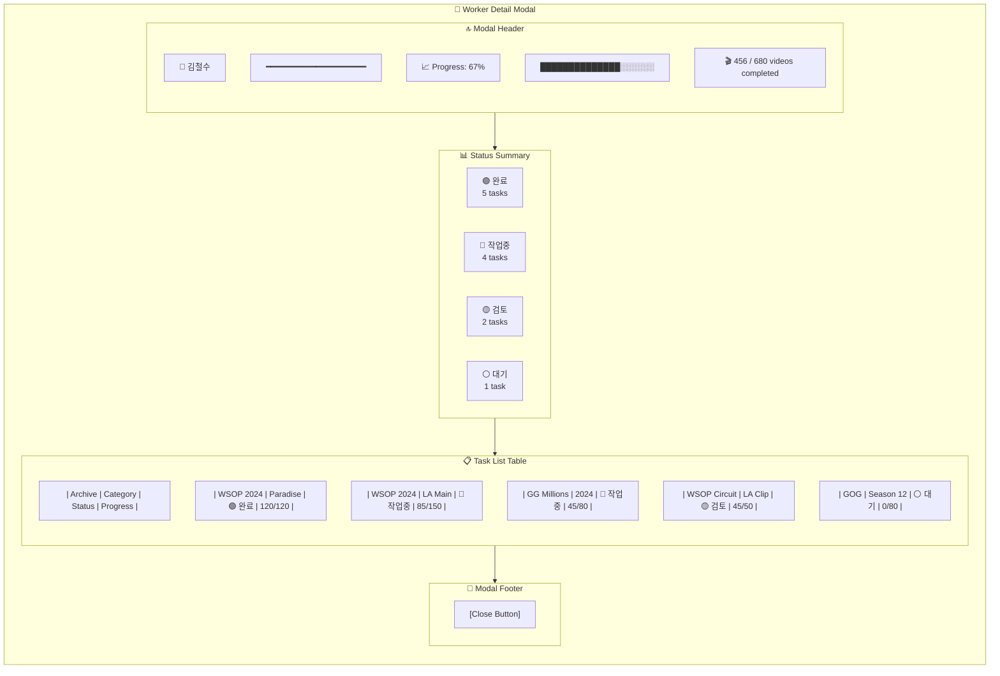

### 2.5 Dashboard - Work Status Summary Card

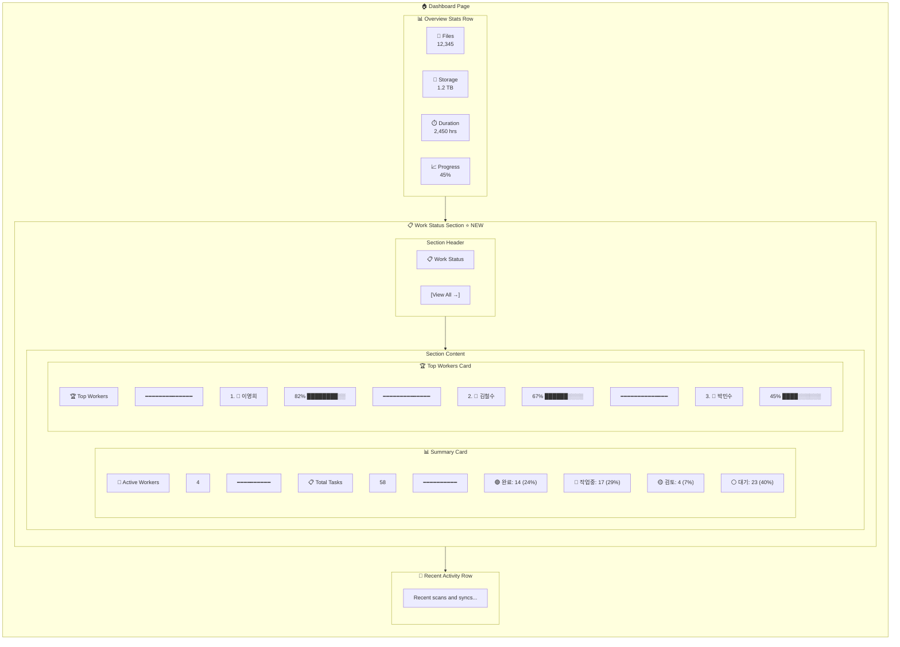

---

## 3. Workflow Design (세로)

### 3.1 Task Status Workflow

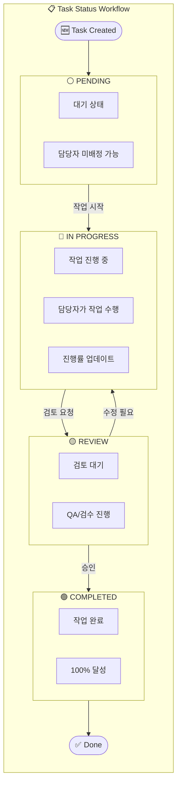

### 3.2 Data Sync Workflow

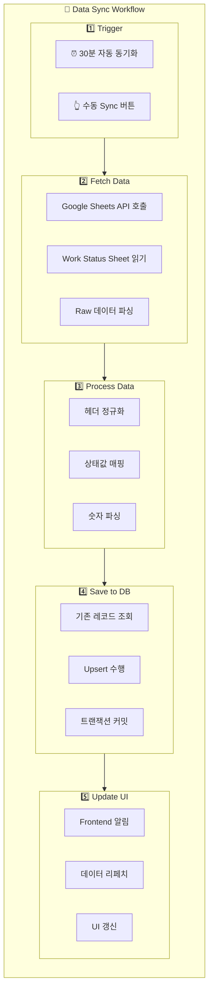

### 3.3 User Interaction Workflow

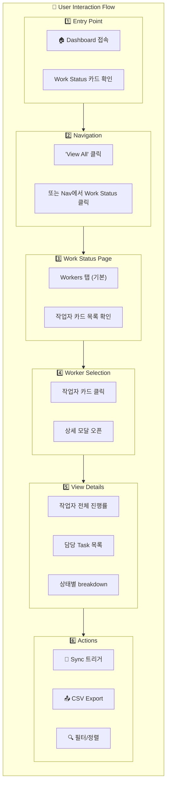

---

## 4. Component Architecture (세로)

### 4.1 Component Hierarchy

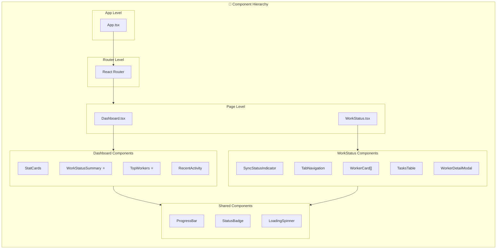

### 4.2 Data Flow Architecture

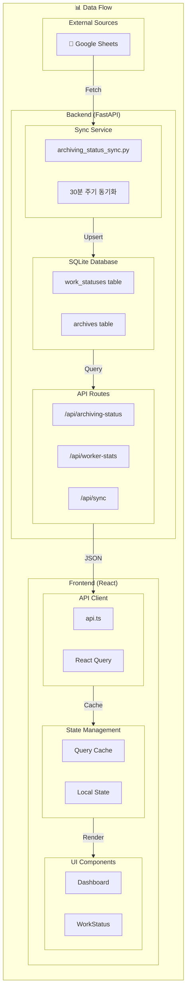

---

## 5. Block Agent Design

### 5.1 Domain Separation

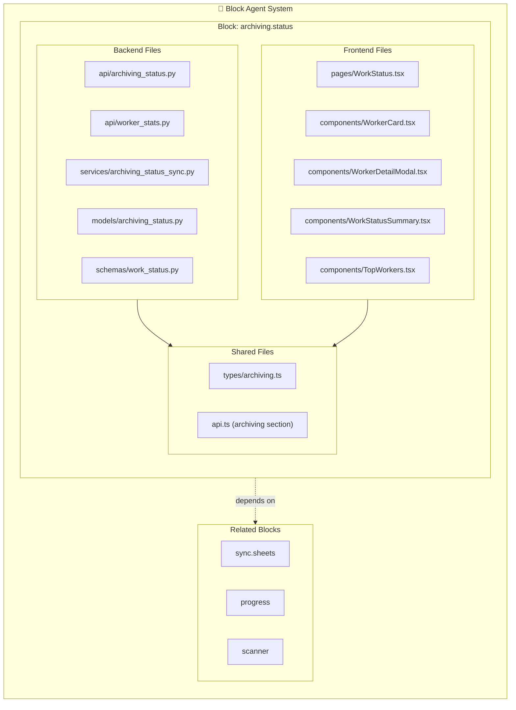

### 5.2 Agent Specification

```yaml
# .claude/agents/archiving-status.md

name: archiving-status
description: 아카이빙 작업 현황 관리 전담 에이전트

responsibilities:
  - Work Status UI 구현 및 유지보수
  - Worker Stats 집계 및 표시
  - Google Sheets 동기화 상태 관리
  - Dashboard Work Status 카드

files:
  backend:
    - backend/app/api/archiving_status.py
    - backend/app/api/worker_stats.py
    - backend/app/services/archiving_status_sync.py
    - backend/app/models/archiving_status.py
    - backend/app/schemas/work_status.py
  frontend:
    - frontend/src/pages/WorkStatus.tsx
    - frontend/src/components/WorkerCard.tsx
    - frontend/src/components/WorkStatusSummary.tsx
    - frontend/src/types/archiving.ts

api_endpoints:
  - GET /api/archiving-status
  - GET /api/worker-stats
  - GET /api/worker-stats/{pic}
  - GET /api/sync/status
  - POST /api/sync/trigger

related_blocks:
  - sync.sheets (동기화 서비스)
  - progress (진행률 계산)
```

---

## 6. Implementation Plan

### 6.1 Phase Overview

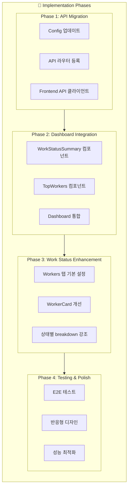

### 6.2 Detailed Tasks

| Phase | Task | File | Description |
|-------|------|------|-------------|
| 1 | Config | `config.py` | `ARCHIVING_STATUS_SHEET_URL` 추가 |
| 1 | API Route | `api/__init__.py` | `/archiving-status` 라우터 등록 |
| 1 | Frontend API | `api.ts` | `archivingStatusApi` 추가 |
| 2 | Summary Card | `WorkStatusSummary.tsx` | 대시보드용 요약 카드 |
| 2 | Top Workers | `TopWorkers.tsx` | 상위 작업자 랭킹 |
| 2 | Dashboard | `Dashboard.tsx` | 새 컴포넌트 통합 |
| 3 | Default Tab | `WorkStatus.tsx` | Workers 탭 기본 |
| 3 | Worker Card | `WorkerCard.tsx` | 상태 breakdown 개선 |

---

## 7. API Specification

### 7.1 Archiving Status API

```typescript
// GET /api/archiving-status
interface ArchivingStatusListResponse {
  items: ArchivingStatus[];
  total_count: number;
  total_videos: number;
  total_done: number;
  overall_progress: number;
}

interface ArchivingStatus {
  id: number;
  archive_id: number;
  archive_name: string | null;
  category: string;
  pic: string | null;           // Person In Charge
  status: 'pending' | 'in_progress' | 'review' | 'completed';
  total_videos: number;
  excel_done: number;
  progress_percent: number;
  notes1: string | null;
  notes2: string | null;
}
```

### 7.2 Worker Stats API

```typescript
// GET /api/worker-stats
interface WorkerStatsResponse {
  workers: WorkerStats[];
  summary: {
    total_workers: number;
    active_workers: number;
    total_tasks: number;
    status_breakdown: Record<string, number>;
  };
}

interface WorkerStats {
  pic: string;
  task_count: number;
  total_videos: number;
  total_done: number;
  progress_percent: number;
  archives: string[];
  status_breakdown: {
    pending: number;
    in_progress: number;
    review: number;
    completed: number;
  };
}
```

---

## 8. File Changes Summary

### 8.1 New Files

| File | Description |
|------|-------------|
| `frontend/src/components/WorkStatusSummary.tsx` | 대시보드용 작업 현황 요약 |
| `frontend/src/components/TopWorkers.tsx` | 상위 작업자 랭킹 |
| `frontend/src/types/archiving.ts` | Archiving 관련 타입 정의 |
| `.claude/agents/archiving-status.md` | 전담 에이전트 정의 |

### 8.2 Modified Files

| File | Change |
|------|--------|
| `frontend/src/services/api.ts` | `archivingStatusApi` 추가 |
| `frontend/src/pages/Dashboard.tsx` | WorkStatusSummary 통합 |
| `frontend/src/pages/WorkStatus.tsx` | Workers 탭 기본 설정 |
| `backend/app/api/__init__.py` | archiving_status 라우터 |

---

## 9. Success Metrics

| Metric | Target |
|--------|--------|
| API Migration | 100% deprecated API 제거 |
| Dashboard Integration | Work Status 카드 표시 |
| Workers View | 기본 탭으로 설정 |
| Block Agent | archiving-status 에이전트 정의 완료 |

---

## 10. Related Documents

- [Issue #37](https://github.com/garimto81/archive_statistics/issues/37) - 이름 변경
- [Issue #40](https://github.com/garimto81/archive_statistics/issues/40) - 본 이슈
- [ARCHITECTURE.md](./ARCHITECTURE.md) - 시스템 구조
- [BLOCK_AGENT_SYSTEM.md](./BLOCK_AGENT_SYSTEM.md) - Block Agent 시스템
