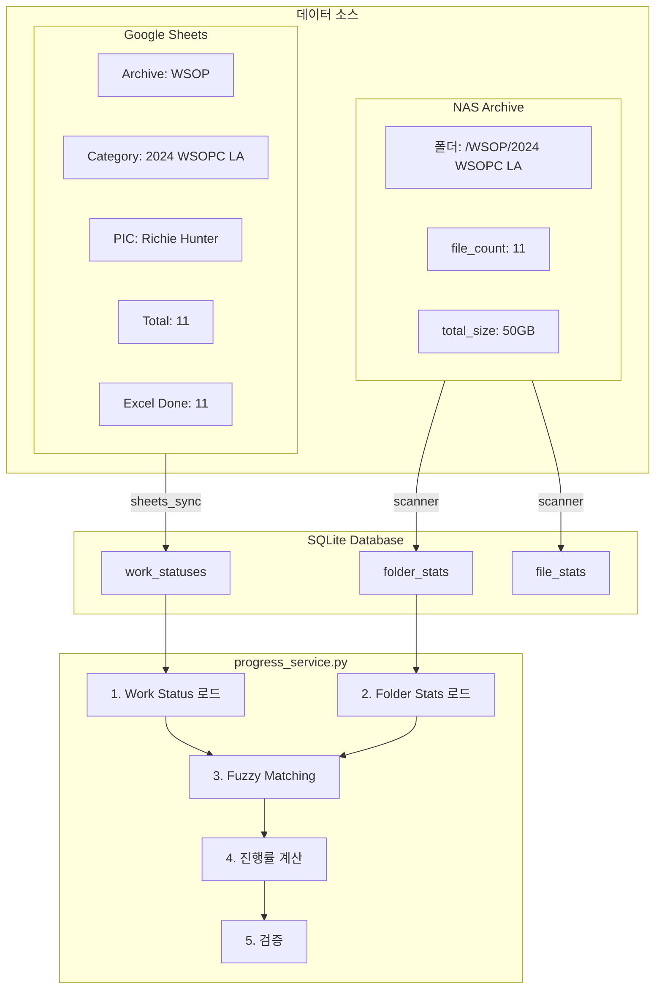
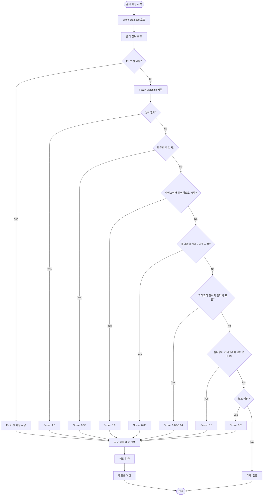
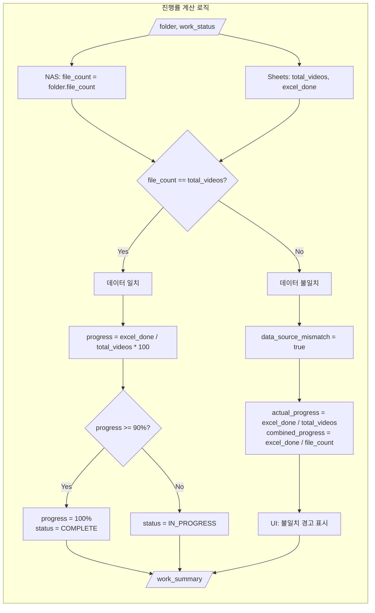
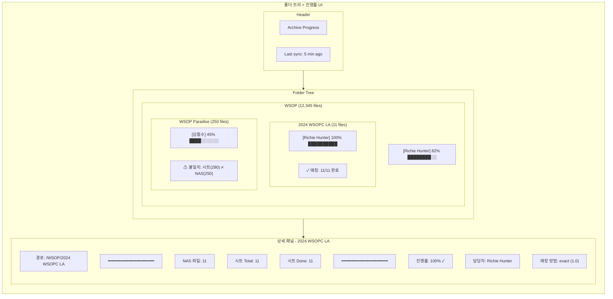

# PRD-0041: Archiving Progress Matching 개선

**Version**: 1.1.0
**Created**: 2025-12-12
**Updated**: 2025-12-12
**Issue**: #42
**Status**: Completed
**PR**: #43, #44

---

## 1. Overview

### 1.1 Background

현재 시스템은 Google Sheets의 `Archiving Work Status` 데이터와 NAS 폴더를 Fuzzy Matching으로 연결하여 진행률을 계산합니다. 그러나 다음과 같은 문제가 있습니다:

1. **파일 수 검증 부재**: `total_videos`와 `file_count` 불일치 시 명확한 처리 없음
2. **완료 기준 모호**: 언제 100% 완료로 처리하는지 명확하지 않음
3. **매칭 신뢰도 표시 부재**: 사용자가 매칭 결과를 검증할 수 없음

### 1.2 Goals

1. **명확한 완료 기준**: `excel_done == total_videos && total_videos == file_count` = 100%
2. **데이터 불일치 가시화**: NAS와 Sheets 데이터 차이를 명확히 표시
3. **매칭 검증 UI**: 자동 매칭 결과를 사용자가 확인/수정 가능
4. **폴더 단위 진행률**: 개별 파일 정보 없이 폴더 레벨에서 진행률 계산

### 1.3 핵심 로직 요약

```
Archiving Work Status 시트 예시:
┌──────────────────┬───────────────┬───────┬──────────┐
│ Category         │ PIC           │ Total │ Done     │
├──────────────────┼───────────────┼───────┼──────────┤
│ 2024 WSOPC LA    │ Richie Hunter │ 11    │ 11       │
└──────────────────┴───────────────┴───────┴──────────┘

의미: "2024 WSOPC LA" 폴더의 11개 파일을 모두 완료
```

---

## 2. Data Flow Design

### 2.1 데이터 소스



### 2.2 동기화 흐름

| 프로세스 | 주기 | 소스 | 타겟 |
|---------|------|------|------|
| sheets_sync | 30분 | Google Sheets | work_statuses |
| scanner | 수동/일일 | NAS | folder_stats, file_stats |
| progress_service | 실시간 | work_statuses + folder_stats | API 응답 |

---

## 3. Matching Algorithm Design

### 3.1 매칭 전략



### 3.2 매칭 점수 테이블

| 전략 | Score | 예시 | 조건 |
|------|-------|------|------|
| `exact` | 1.0 | "2024 WSOPC LA" == "2024 WSOPC LA" | 대소문자 무시 |
| `exact_normalized` | 0.98 | "2024-WSOPC_LA" == "2024 WSOPC LA" | 하이픈/밑줄 정규화 |
| `subset` | 0.88-0.94 | "2024 WSOPC LA" ⊂ "2024 WSOPC LA Main" | 단어 수 비례 |
| `folder_prefix` | 0.85 | "GOG 최종" starts with "GOG" | - |
| `word` | 0.8 | "WSOP" in "WSOP Paradise" | 독립 단어 |
| `year` | 0.7 | "2024" matches year in category | 4자리 연도 |

---

## 4. Progress Calculation Logic

### 4.1 진행률 계산 규칙



### 4.2 완료 판정 조건

```python
# 100% 완료 조건 (모두 충족해야 함)
is_complete = (
    sheets_done == sheets_total        # 시트상 모든 작업 완료
    and sheets_total == nas_files      # 파일 수 일치
)

# 90% 이상이면 100%로 표시 (반올림 처리)
if actual_progress >= 90:
    actual_progress = 100.0
```

### 4.3 검증 규칙

| 규칙 | 조건 | 처리 |
|------|------|------|
| 유효한 매칭 | `sheets_done <= nas_files` | 위반 시 매칭 무효화 |
| 데이터 일치 | `\|nas_files - sheets_total\| <= 10%` | 위반 시 경고 표시 |
| 100% 완료 | `done == total == nas_files` | 완료 뱃지 표시 |

---

## 5. UI Design

### 5.1 폴더 트리 진행률 표시



### 5.2 진행률 표시 컴포넌트

```
일반:      ████████░░ 82%
완료:      ██████████ 100% ✓
불일치:    ████░░░░░░ 45% ⚠
미매칭:    ░░░░░░░░░░ -
```

### 5.3 상세 패널 정보

| 필드 | 설명 |
|------|------|
| NAS 파일 수 | folder_stats.file_count |
| 시트 Total | work_status.total_videos |
| 시트 Done | work_status.excel_done |
| 진행률 (시트 기준) | excel_done / total_videos |
| 진행률 (NAS 기준) | excel_done / file_count |
| 데이터 일치 여부 | ✓ / ⚠ |
| 매칭 방법 | exact / prefix / word 등 |
| 매칭 점수 | 0.0 ~ 1.0 |

---

## 6. Block Agent Design

### 6.1 Block Index 확장

```
=== BLOCK INDEX: progress_service.py ===
| Block ID              | Lines     | Description              |
|-----------------------|-----------|--------------------------|
| progress.utils        | 25-55     | 정규화/유사도 헬퍼       |
| progress.data_loader  | 105-160   | DB 데이터 로드           |
| progress.matcher      | 162-285   | 폴더-카테고리 매칭       |
| progress.validator    | NEW       | 매칭 검증 로직 (신규)    |
| progress.calculator   | NEW       | 진행률 계산 (신규)       |
| progress.aggregator   | 325-642   | 하이어라키 합산          |
| progress.folder_detail| 710-854   | 폴더 상세 조회           |
================================================
```

### 6.2 신규 Block: progress.validator

```python
# === BLOCK: progress.validator ===
# Description: 매칭 검증 및 진행률 계산
# Dependencies: progress.matcher
# AI Context: 진행률 계산/완료 판정 수정 시

def validate_match(folder: FolderStats, work_status: dict) -> dict:
    """매칭 검증 및 진행률 계산"""
    nas_files = folder.file_count
    sheets_total = work_status.get("total_videos", 0)
    sheets_done = work_status.get("excel_done", 0)

    # 검증 1: done이 nas_files보다 크면 무효
    if sheets_done > nas_files:
        return {"valid": False, "reason": "done > nas_files"}

    # 검증 2: 10% 이상 불일치 경고
    mismatch_ratio = abs(nas_files - sheets_total) / max(nas_files, sheets_total, 1)
    data_match = mismatch_ratio <= 0.1

    # 진행률 계산
    actual_progress = (sheets_done / sheets_total * 100) if sheets_total > 0 else 0
    combined_progress = (sheets_done / nas_files * 100) if nas_files > 0 else 0

    # 90% 이상 완료 처리
    if actual_progress >= 90:
        actual_progress = 100.0

    is_complete = (sheets_done == sheets_total) and (sheets_total == nas_files)

    return {
        "valid": True,
        "actual_progress": round(actual_progress, 1),
        "combined_progress": round(combined_progress, 1),
        "is_complete": is_complete,
        "data_match": data_match,
        "mismatch_count": sheets_total - nas_files,
    }

# === END BLOCK: progress.validator ===
```

---

## 7. API Design

### 7.1 기존 API 확장

**GET /api/progress/tree**

Response 확장:
```json
{
  "tree": [{
    "name": "2024 WSOPC LA",
    "path": "/WSOP/2024 WSOPC LA",
    "file_count": 11,
    "work_summary": {
      "task_count": 1,
      "total_files": 11,
      "total_done": 11,
      "combined_progress": 100.0,
      "sheets_total_videos": 11,
      "sheets_excel_done": 11,
      "actual_progress": 100.0,
      "data_source_mismatch": false,
      "mismatch_count": 0,
      "is_complete": true,
      "matching_method": "exact",
      "matching_score": 1.0
    }
  }]
}
```

### 7.2 신규 API (선택)

**GET /api/folder-mapping/validation**

매칭 검증 결과 조회:
```json
{
  "total_folders": 150,
  "matched_folders": 58,
  "unmatched_folders": 92,
  "complete_folders": 14,
  "mismatch_warnings": 12,
  "warnings": [
    {
      "folder_path": "/WSOP/Paradise",
      "folder_files": 250,
      "sheets_total": 280,
      "mismatch_percent": 12.0
    }
  ]
}
```

---

## 8. Implementation Plan

### Phase 1: Backend 개선 ✅ (PR #43)

| Task | 파일 | 설명 | Status |
|------|------|------|--------|
| 1.1 | progress_service.py | `progress.validator` 블록 추가 | ✅ |
| 1.2 | progress_service.py | `_build_folder_progress` 개선 | ✅ |
| 1.3 | api/progress.py | `is_complete`, `matching_score` 필드 추가 | ✅ |
| 1.4 | types/index.ts | `WorkSummary` 타입 확장 | ✅ |

### Phase 2: Frontend UI 개선 ✅ (PR #44)

| Task | 파일 | 설명 | Status |
|------|------|------|--------|
| 2.1 | MasterFolderTree/index.tsx | Work Badge 개선 (`is_complete` ✓, `mismatch` ⚠) | ✅ |
| 2.2 | MasterFolderDetail/index.tsx | ProgressSection 개선 (매칭 정보, 경고) | ✅ |

### Phase 3: 테스트 및 문서화 ✅

| Task | 설명 | Status |
|------|------|--------|
| 3.1 | Unit 테스트 (validate_match) | ✅ |
| 3.2 | TypeScript 컴파일 검증 | ✅ |
| 3.3 | PRD-0041 문서 업데이트 | ✅ |
| 3.4 | CLAUDE.md 버전 업데이트 | ✅ |

---

## 9. Success Metrics

| Metric | Target |
|--------|--------|
| 매칭 정확도 | 95% 이상 |
| 데이터 불일치 감지 | 100% |
| 100% 완료 판정 정확도 | 100% |
| API 응답 시간 | 1초 이내 |

---

## 10. Critical Files

| 파일 | 역할 |
|------|------|
| `backend/app/services/progress_service.py` | 핵심 매칭/진행률 로직 |
| `backend/app/api/progress.py` | Progress API |
| `frontend/src/components/MasterFolderTree/index.tsx` | 트리 UI |
| `frontend/src/components/MasterFolderDetail/index.tsx` | 상세 패널 |

---

## 11. Related Documents

- [PRD-0040: Archiving Status UI](./PRD-0040-ARCHIVING-STATUS-UI.md)
- [ARCHITECTURE.md](./ARCHITECTURE.md)
- [BLOCK_AGENT_SYSTEM.md](./BLOCK_AGENT_SYSTEM.md)
