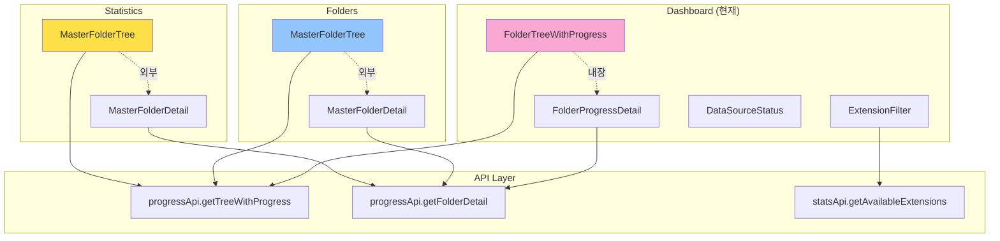
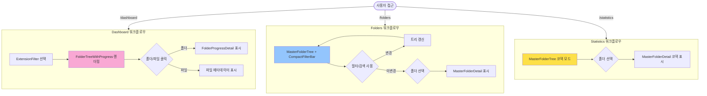
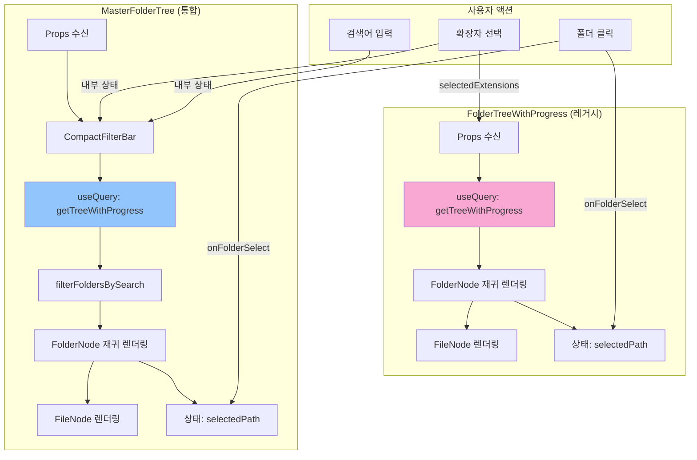
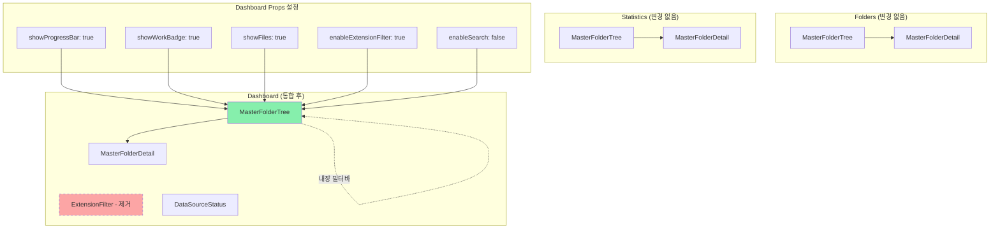

# PRD-0049: FolderTreeWithProgress + MasterFolderTree 통합

**Status**: Draft
**Created**: 2025-12-12
**Author**: Claude Code
**Related Issues**: #48
**Related PRDs**: PRD-0033 (FOLDER-TREE-UNIFICATION)

---

## 1. 개요

### 1.1 배경

현재 프로젝트에 두 개의 폴더 트리 컴포넌트가 공존:

- **FolderTreeWithProgress** (레거시): Dashboard에서 사용, 진행률 표시 중심
- **MasterFolderTree** (PRD-0033): Folders, Statistics에서 사용, 통합 컴포넌트

Issue #48에 따라 FolderTreeWithProgress를 삭제하고 MasterFolderTree로 통합 필요.

### 1.2 목표

1. 두 컴포넌트의 기능 차이 분석
2. 인과관계 및 데이터 흐름 파악
3. 통합 전략 수립
4. 마이그레이션 계획 수립

---

## 2. 현재 상태 분석

### 2.1 사용 현황

| 페이지 | 사용 컴포넌트 | 용도 |
|--------|--------------|------|
| Dashboard | FolderTreeWithProgress | 진행률 표시 중심, 파일 상세 패널 |
| Folders | MasterFolderTree | 폴더 탐색, 필터링, 검색 |
| Statistics | MasterFolderTree | 코덱 정보 표시 |

### 2.2 코드 위치

| 컴포넌트 | 파일 경로 | 라인 수 |
|---------|----------|---------|
| FolderTreeWithProgress | `frontend/src/components/FolderTreeWithProgress.tsx` | 1009 |
| MasterFolderTree | `frontend/src/components/MasterFolderTree/index.tsx` | 692 |
| CompactFilterBar | `frontend/src/components/MasterFolderTree/CompactFilterBar.tsx` | 328 |
| MasterFolderDetail | `frontend/src/components/MasterFolderDetail/index.tsx` | (미확인) |

---

## 3. 컴포넌트 기능 비교

### 3.1 FolderTreeWithProgress 특징

| 기능 | 구현 여부 | 설명 |
|------|----------|------|
| **진행률 표시** | ✅ | work_summary 기반 프로그레스바 + 백분율 |
| **작업 현황 뱃지** | ✅ | done/total, is_complete, data_source_mismatch |
| **코덱 모드** | ✅ | displayMode: 'progress' / 'codec' |
| **파일 노드** | ✅ | showFiles prop으로 제어 |
| **Lazy Loading** | ✅ | enableLazyLoading prop |
| **상세 패널 내장** | ✅ | FolderProgressDetail 컴포넌트 export |
| **필터바** | ❌ | 없음 (Extension Filter는 Dashboard에서 별도) |
| **검색** | ❌ | 없음 |
| **숨김 파일 필터** | ❌ | 없음 |
| **Block Agent 구조** | ✅ | 7개 블록으로 구조화 (AI 컨텍스트 최적화) |

### 3.2 MasterFolderTree 특징

| 기능 | 구현 여부 | 설명 |
|------|----------|------|
| **진행률 표시** | ✅ | showProgressBar prop으로 선택적 |
| **작업 현황 뱃지** | ✅ | showWorkBadge prop으로 선택적 |
| **코덱 뱃지** | ✅ | showCodecBadge prop으로 선택적 |
| **파일 노드** | ✅ | showFiles prop으로 제어 |
| **Lazy Loading** | ✅ | enableLazyLoading prop |
| **상세 패널 내장** | ❌ | MasterFolderDetail 별도 컴포넌트 |
| **필터바** | ✅ | CompactFilterBar 통합 |
| **검색** | ✅ | enableSearch prop |
| **숨김 파일 필터** | ✅ | enableHiddenFilter prop |
| **Block Agent 구조** | ❌ | 없음 (단일 파일) |

### 3.3 핵심 차이점

| 항목 | FolderTreeWithProgress | MasterFolderTree |
|------|----------------------|------------------|
| **설계 철학** | 진행률 표시 + 상세 패널 일체형 | 범용 트리 + Props 기반 커스터마이징 |
| **필터/검색** | 없음 (상위 컴포넌트 의존) | CompactFilterBar 내장 |
| **상세 패널** | FolderProgressDetail 내장 | MasterFolderDetail 외부 컴포넌트 |
| **displayMode** | 'progress' / 'codec' | showProgressBar / showCodecBadge |
| **디버깅** | DEBUG_WORK_SUMMARY 플래그 | 없음 |
| **범례** | ProgressLegend 내장 | 없음 |
| **API 호출** | progressApi.getTreeWithProgress | progressApi.getTreeWithProgress (동일) |

---

## 4. Mermaid 다이어그램

### 4.1 컴포넌트 인과관계 다이어그램



### 4.2 UI 워크플로우 다이어그램 (세로)



### 4.3 데이터 흐름 다이어그램



### 4.4 통합 후 아키텍처



---

## 5. 통합 전략

### 5.1 기능 매핑 전략

| FolderTreeWithProgress 기능 | MasterFolderTree 대응 | 비고 |
|---------------------------|---------------------|------|
| displayMode: 'progress' | showProgressBar: true | Props 변경 |
| displayMode: 'codec' | showCodecBadge: true | Props 변경 |
| ProgressLegend | CompactFilterBar 하단에 추가 | 새 기능 |
| FolderProgressDetail | MasterFolderDetail mode: 'progress' | 외부 컴포넌트 |
| DEBUG_WORK_SUMMARY | 제거 (개발 완료 후 불필요) | 정리 |
| getWorkSummary 헬퍼 | MasterFolderTree에 이미 존재 | 중복 제거 |

### 5.2 Props 변환표

#### Dashboard 사용 예시

**Before (FolderTreeWithProgress)**:
```tsx
<FolderTreeWithProgress
  initialDepth={3}
  showFiles={true}
  enableLazyLoading={true}
  selectedExtensions={extensionsArray}
  displayMode="progress"
  onFolderSelect={handleFolderSelect}
  onFileSelect={handleFileSelect}
/>
```

**After (MasterFolderTree)**:
```tsx
<MasterFolderTree
  // 기본 설정
  initialDepth={3}
  showFiles={true}
  enableLazyLoading={true}

  // 표시 옵션 (displayMode 대체)
  showProgressBar={true}
  showWorkBadge={true}
  showCodecBadge={false}

  // 필터바 설정 (ExtensionFilter 대체)
  showFilterBar={true}
  filterBarTitle="Progress Overview"
  enableExtensionFilter={true}
  enableHiddenFilter={false}
  enableDisplayToggles={false}
  enableSearch={false}

  // 콜백
  onFolderSelect={handleFolderSelect}
  onFileSelect={handleFileSelect}

  // 외부 필터 연동 (제거 가능)
  selectedExtensions={extensionsArray}
/>
```

### 5.3 상세 패널 통합 전략

**Before**: FolderProgressDetail (내장)
```tsx
// FolderTreeWithProgress.tsx 내부
export function FolderProgressDetail({ folderPath, onFileSelect }) {
  // ...
}
```

**After**: MasterFolderDetail (외부)
```tsx
// Dashboard.tsx
{selectedFolder && (
  <MasterFolderDetail
    folder={selectedFolder}
    mode="progress"
    onClose={() => setSelectedFolder(null)}
    onFileSelect={handleFileSelect}
  />
)}
```

### 5.4 범례 (Legend) 처리 전략

FolderTreeWithProgress의 ProgressLegend는 MasterFolderTree에 없음.

**옵션 1**: CompactFilterBar에 범례 추가
- Pros: 한 줄 레이아웃 유지
- Cons: 공간 부족

**옵션 2**: MasterFolderTree에 범례 슬롯 추가
- Pros: 유연성
- Cons: Props 복잡도 증가

**선택**: 옵션 2 (showLegend prop + 커스텀 범례 슬롯)

---

## 6. 마이그레이션 계획

### 6.1 Phase 1: MasterFolderTree 기능 보완

**Goal**: FolderTreeWithProgress의 고유 기능 이식

| 작업 | 내용 | 난이도 |
|------|------|--------|
| 1-1 | MasterFolderTree에 showLegend prop 추가 | Low |
| 1-2 | ProgressLegend 컴포넌트를 MasterFolderTree/Legend.tsx로 이동 | Low |
| 1-3 | DEBUG_WORK_SUMMARY 로직 제거 (불필요) | Low |
| 1-4 | getWorkSummary 헬퍼 중복 확인 및 통합 | Medium |
| 1-5 | FileNode 메타데이터 표시 로직 동기화 (용량·코덱·재생시간) | Low |

**Acceptance Criteria**:
- MasterFolderTree가 FolderTreeWithProgress의 모든 시각적 요소 재현 가능
- E2E 테스트: Dashboard 렌더링 동일

### 6.2 Phase 2: Dashboard 마이그레이션

**Goal**: Dashboard에서 FolderTreeWithProgress를 MasterFolderTree로 교체

| 작업 | 내용 | 난이도 |
|------|------|--------|
| 2-1 | ExtensionFilter 제거 (CompactFilterBar 사용) | Low |
| 2-2 | FolderTreeWithProgress를 MasterFolderTree로 교체 | Medium |
| 2-3 | FolderProgressDetail을 MasterFolderDetail로 교체 | Medium |
| 2-4 | Props 변환 (displayMode → showProgressBar 등) | Low |
| 2-5 | 상태 관리 조정 (selectedFolder, selectedFile) | Low |
| 2-6 | UI 레이아웃 검증 (Progress Overview + Detail Panel) | Medium |

**Acceptance Criteria**:
- Dashboard 기능 100% 유지
- 성능 저하 없음 (렌더링 시간 ±10% 이내)
- E2E 테스트 통과

### 6.3 Phase 3: 레거시 정리

**Goal**: FolderTreeWithProgress 제거 및 문서 정리

| 작업 | 내용 | 난이도 |
|------|------|--------|
| 3-1 | FolderTreeWithProgress.tsx 파일 삭제 | Low |
| 3-2 | ExtensionFilter.tsx 파일 삭제 (중복) | Low |
| 3-3 | import 경로 정리 (Dashboard, types 등) | Low |
| 3-4 | CLAUDE.md 업데이트 (핵심 파일 목록) | Low |
| 3-5 | ARCHITECTURE.md 업데이트 (컴포넌트 구조) | Medium |
| 3-6 | Block Agent System 문서 업데이트 | Low |

**Acceptance Criteria**:
- FolderTreeWithProgress 관련 모든 코드 제거
- 빌드 에러 없음
- 문서 최신화 완료

### 6.4 검증 계획

| 검증 항목 | 방법 | 기준 |
|---------|------|------|
| **기능 동등성** | 수동 테스트 (체크리스트) | 모든 기능 동작 |
| **시각적 일관성** | 스크린샷 비교 | Pixel-perfect 일치 |
| **성능** | React DevTools Profiler | 렌더링 시간 ±10% |
| **접근성** | axe-core | WCAG 2.1 AA 준수 |
| **반응형** | 3개 뷰포트 테스트 | 레이아웃 깨짐 없음 |

---

## 7. 위험 관리

### 7.1 잠재적 문제점

| 위험 | 영향도 | 완화 전략 |
|------|--------|----------|
| work_summary 로직 불일치 | High | Phase 1-4에서 헬퍼 함수 통합 검증 |
| 범례 표시 누락 | Medium | Phase 1-2에서 ProgressLegend 이식 |
| ExtensionFilter 기능 손실 | Medium | CompactFilterBar 기능 완전성 확인 |
| FolderProgressDetail 기능 차이 | High | MasterFolderDetail mode: 'progress' 검증 |
| 성능 저하 | Low | Lazy Loading, useMemo 최적화 |

### 7.2 롤백 계획

**Phase 2 실패 시**:
1. git revert [commit-hash]
2. FolderTreeWithProgress 복원
3. 원인 분석 후 Phase 1 재검토

**Phase 3 완료 후 버그 발견 시**:
1. Hotfix 브랜치 생성
2. MasterFolderTree 수정 (레거시 복원 금지)
3. 단위 테스트 추가

---

## 8. 타임라인 (예상)

| Phase | 작업 | 예상 소요 시간 |
|-------|------|---------------|
| Phase 1 | MasterFolderTree 기능 보완 | 2-3시간 |
| Phase 2 | Dashboard 마이그레이션 | 3-4시간 |
| Phase 3 | 레거시 정리 | 1-2시간 |
| **합계** | | **6-9시간** |

---

## 9. 체크리스트

### Phase 1 완료 조건
- [ ] showLegend prop 추가
- [ ] ProgressLegend 컴포넌트 이동
- [ ] getWorkSummary 헬퍼 통합
- [ ] FileNode 메타데이터 동기화
- [ ] E2E 테스트: Folders, Statistics 정상 동작

### Phase 2 완료 조건
- [ ] Dashboard에서 FolderTreeWithProgress 제거
- [ ] MasterFolderTree Props 설정 완료
- [ ] MasterFolderDetail mode: 'progress' 적용
- [ ] ExtensionFilter 제거 (CompactFilterBar 사용)
- [ ] UI 레이아웃 검증 (3개 뷰포트)
- [ ] E2E 테스트: Dashboard 전체 시나리오

### Phase 3 완료 조건
- [ ] FolderTreeWithProgress.tsx 삭제
- [ ] ExtensionFilter.tsx 삭제
- [ ] import 경로 정리
- [ ] CLAUDE.md 업데이트
- [ ] ARCHITECTURE.md 업데이트
- [ ] npm run lint 통과
- [ ] npm run build 성공

---

## 10. 참고 자료

### 10.1 관련 이슈
- Issue #48: FolderTreeWithProgress 삭제
- Issue #40: Archiving Status 적용
- Issue #34: MasterFolderTree 통합

### 10.2 관련 PRD
- PRD-0033: FOLDER-TREE-UNIFICATION.md (MasterFolderTree 설계)
- PRD-0041: ARCHIVING-STATUS.md (work_summary 로직)

### 10.3 핵심 파일
- `frontend/src/components/FolderTreeWithProgress.tsx` (삭제 대상)
- `frontend/src/components/MasterFolderTree/index.tsx` (통합 컴포넌트)
- `frontend/src/components/MasterFolderTree/CompactFilterBar.tsx`
- `frontend/src/components/MasterFolderDetail/index.tsx`
- `frontend/src/pages/Dashboard.tsx` (마이그레이션 대상)

---

## 11. 승인 기록

| 역할 | 이름 | 승인 날짜 | 상태 |
|------|------|----------|------|
| 작성자 | Claude Code | 2025-12-12 | Draft |
| 리뷰어 | - | - | Pending |
| 승인자 | - | - | Pending |

---

**End of PRD-0049**
