# NAS 폴더 통계 계산 로직 리팩토링 설계

**Version**: 1.2.0 | **Date**: 2025-12-13 | **Status**: Design Complete

---

## 1. 현재 문제점 분석

### 1.1 용어 혼란: 같은 이름, 다른 의미

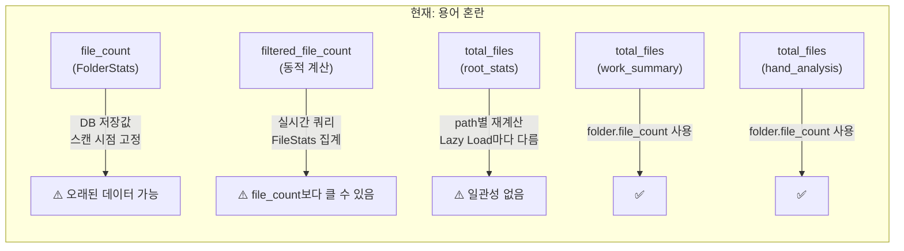

### 1.2 데이터 흐름 불일치

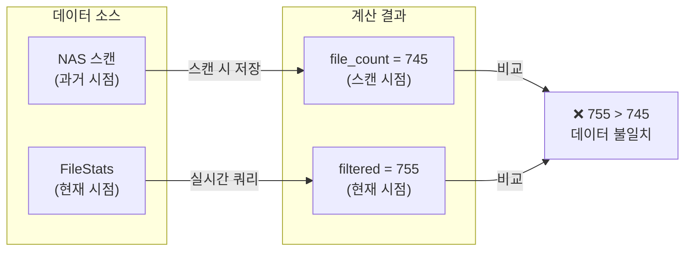

### 1.3 root_stats 불일치 문제

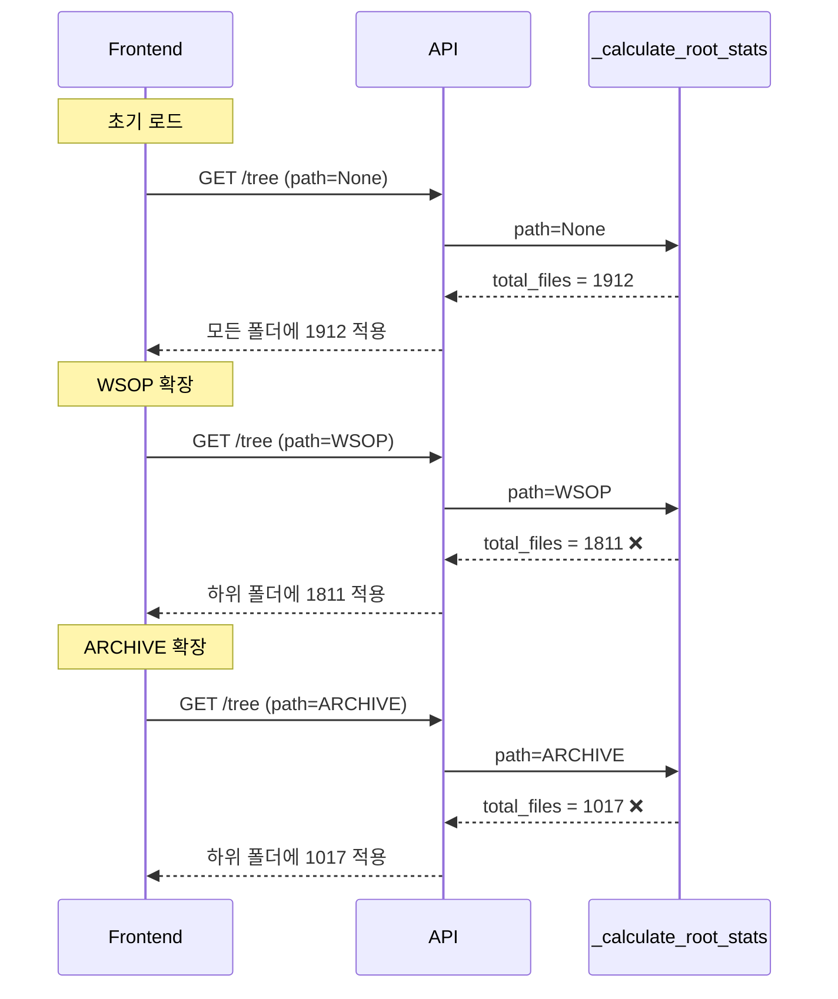

---

## 2. 개선안 설계

### 2.1 핵심 원칙

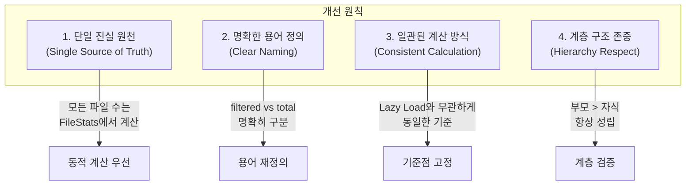

### 2.2 용어 재정의

| 현재 용어 | 문제점 | 새로운 용어 | 의미 |
|-----------|--------|-------------|------|
| `file_count` | 스캔 시점 고정 | `stored_file_count` | DB에 저장된 값 (참조용) |
| `filtered_file_count` | 혼란스러움 | `visible_file_count` | 필터 적용 후 표시할 파일 수 |
| N/A | 없음 | `actual_file_count` | FileStats에서 실시간 계산 |
| `root_stats.total_files` | Lazy Load마다 다름 | `archive_total_files` | 전체 아카이브 파일 수 (고정) |

### 2.3 새로운 데이터 구조

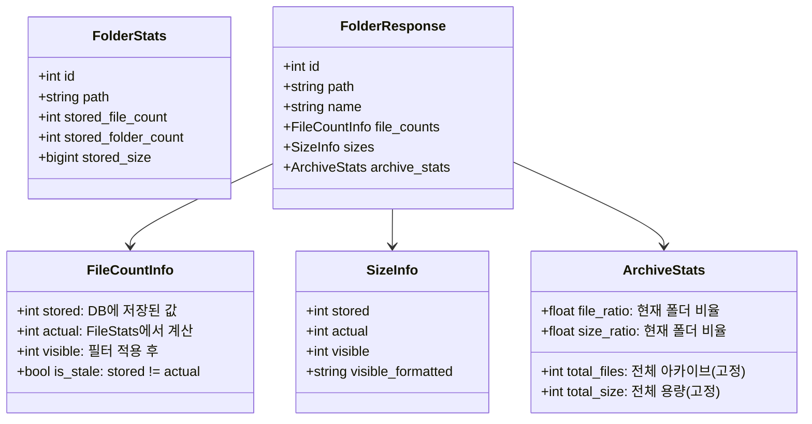

---

## 3. 개선된 계산 흐름

### 3.1 파일 수 계산 통합

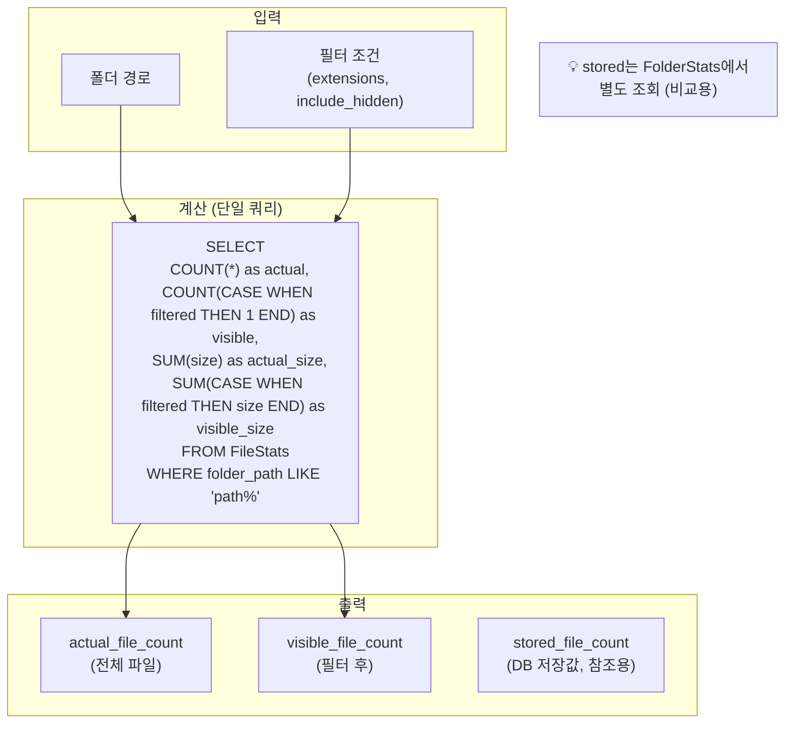

### 3.2 archive_stats 계산 (한 번만)

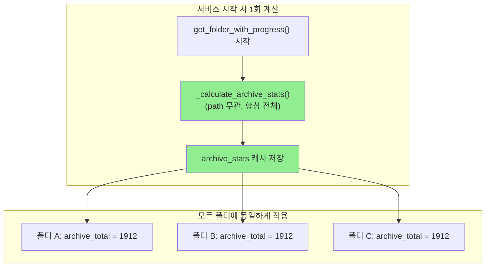

### 3.3 Lazy Load 시에도 일관된 기준

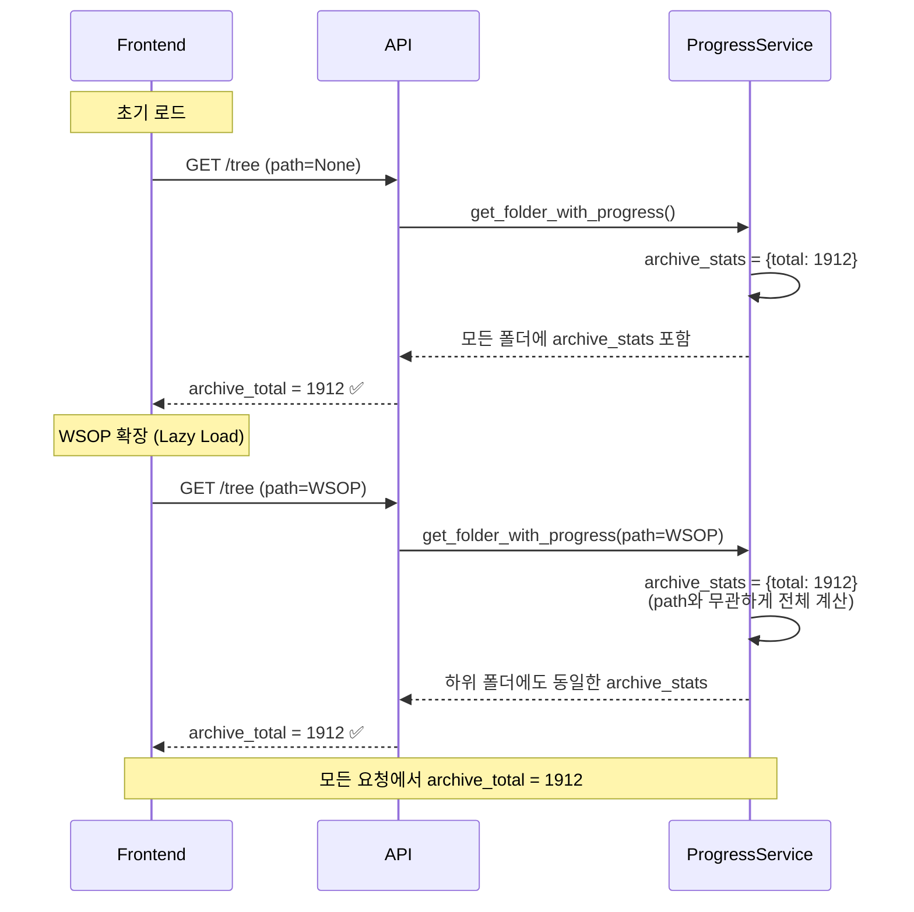

---

## 4. 코드 블록 재구성

### 4.1 현재 블록 구조

```
progress.utils          → 유지
progress.root_stats     → ❌ 제거/대체
progress.data_loader    → 유지
progress.ancestor_matcher → 유지
progress.matcher        → 유지
progress.validator      → 유지
progress.file_matcher   → 유지
progress.aggregator     → ⚠️ 수정 필요
progress.file_query     → 유지
progress.folder_detail  → ⚠️ 수정 필요
progress.file_detail    → 유지
```

### 4.2 새로운 블록 구조

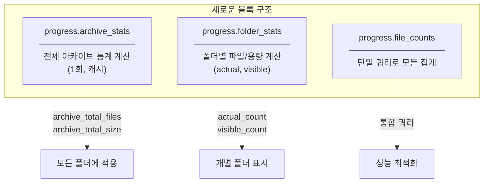

---

## 5. 구현 계획

### 5.1 Phase 1: 데이터 구조 정의

```python
# 새로운 타입 정의
class FileCountInfo(BaseModel):
    stored: int       # FolderStats.file_count (참조용)
    actual: int       # FileStats COUNT(*) 실시간
    visible: int      # 필터 적용 후
    is_stale: bool    # stored != actual

class ArchiveStats(BaseModel):
    total_files: int      # 전체 아카이브 파일 수 (고정)
    total_size: int       # 전체 용량
    total_duration: float # 전체 재생시간
```

### 5.2 Phase 2: 계산 함수 리팩토링

```python
# Before (문제)
async def _calculate_root_stats(self, db, path, extensions):
    if path:
        # path 기준으로 계산 → 불일치 발생
        ...
    else:
        # 전체 계산
        ...

# After (개선)
async def _calculate_archive_stats(self, db) -> ArchiveStats:
    """전체 아카이브 통계 (path 무관, 항상 동일)"""
    # 항상 전체 계산, 캐시 가능
    ...

async def _calculate_folder_file_counts(
    self, db, folder_path, extensions, include_hidden
) -> FileCountInfo:
    """폴더별 파일 수 계산 (단일 쿼리)"""
    ...
```

### 5.3 Phase 3: 응답 구조 변경

```python
# Before
folder_dict["file_count"] = folder.file_count
folder_dict["filtered_file_count"] = filtered_row.count
folder_dict["root_stats"] = {
    "total_files": root_total_files,  # path마다 다름
    ...
}

# After
folder_dict["file_counts"] = {
    "stored": folder.file_count,       # DB 저장값 (참조)
    "actual": actual_count,            # 실시간 계산
    "visible": visible_count,          # 필터 적용
    "is_stale": folder.file_count != actual_count
}
folder_dict["archive_stats"] = {
    "total_files": archive_stats.total_files,  # 항상 동일
    ...
}
```

---

## 6. 기대 효과

### 6.1 Before vs After

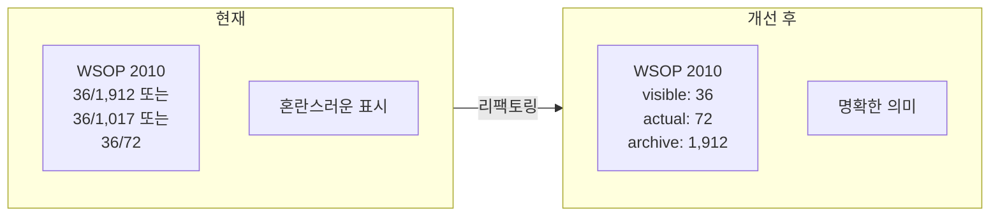

### 6.2 UI 표시 예시

```
폴더명: WSOP 2010
├─ 파일 수: 36 / 72 (visible/actual)
├─ 전체 대비: 3.8% (72/1,912)
├─ 용량: 1.60 TB
└─ 상태: ⚠️ 데이터 업데이트 필요 (is_stale=true)
```

---

## 7. 마이그레이션 전략

### 7.1 단계별 적용

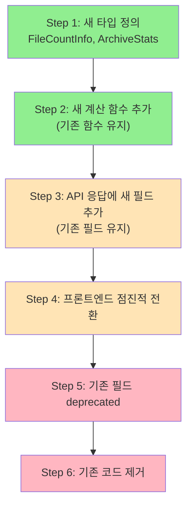

### 7.2 하위 호환성

```python
# 마이그레이션 기간 동안 두 형식 모두 제공
folder_dict = {
    # 기존 필드 (deprecated, 호환성 유지)
    "file_count": folder.file_count,
    "filtered_file_count": visible_count,
    "root_stats": {...},  # 기존 형식

    # 새 필드 (권장)
    "file_counts": FileCountInfo(...),
    "archive_stats": ArchiveStats(...),
}
```

---

## 8. 실제 코드 블록 분석 (상세)

### 8.1 문제 코드 위치

```
backend/app/services/progress_service.py
```

#### BLOCK: progress.root_stats (Lines 185-264) - ❌ 제거 대상

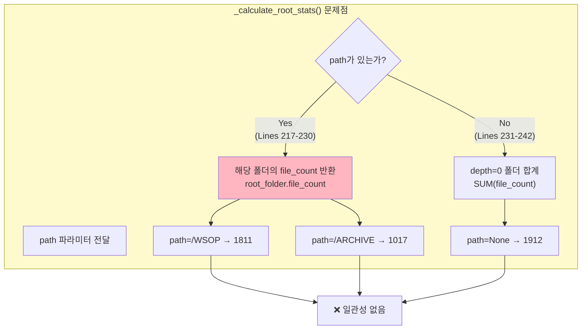

#### BLOCK: progress.aggregator (Lines 646-799) - ⚠️ 수정 대상

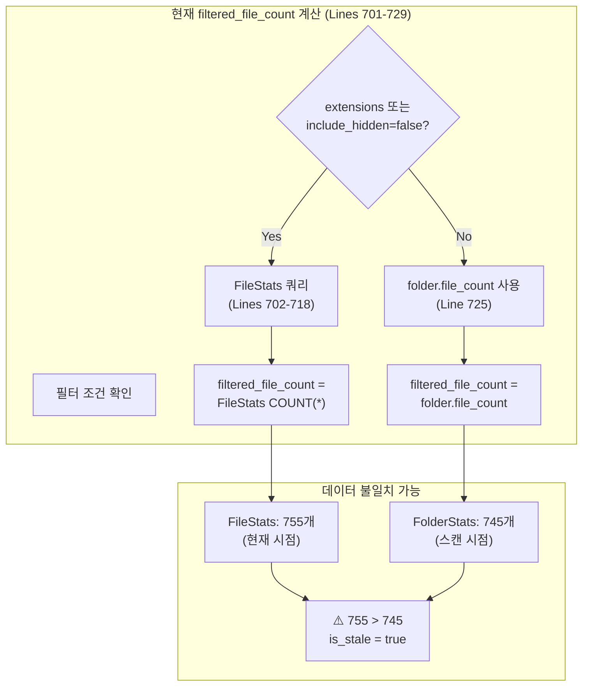

### 8.2 변경 계획 상세

#### 8.2.1 새 함수: _calculate_archive_stats()

```python
# progress_service.py - 새 BLOCK: progress.archive_stats

async def _calculate_archive_stats(self, db: AsyncSession) -> Dict[str, Any]:
    """전체 아카이브 통계 계산 (path 무관, 항상 전체)

    핵심 변경:
    - path 파라미터 제거
    - 항상 depth=0 폴더들의 합계 반환
    - 캐시 가능 (5분 TTL)

    Returns:
        {
            "total_files": 전체 파일 수 (항상 고정),
            "total_size": 전체 용량,
            "total_size_formatted": 포맷된 용량,
        }
    """
    # 항상 전체 ARCHIVE 통계 (path 무관)
    stats_query = select(
        func.sum(FolderStats.file_count),
        func.sum(FolderStats.total_size),
        func.sum(FolderStats.total_duration),
    ).where(FolderStats.depth == 0)

    stats_result = await db.execute(stats_query)
    row = stats_result.fetchone()

    return {
        "total_files": row[0] or 0,
        "total_size": row[1] or 0,
        "total_size_formatted": format_size(row[1] or 0),
        "total_duration": row[2] or 0,
        "total_duration_formatted": format_duration(row[2] or 0),
    }
```

#### 8.2.2 새 함수: _calculate_folder_file_counts()

```python
# progress_service.py - 새 BLOCK: progress.file_counts

async def _calculate_folder_file_counts(
    self,
    db: AsyncSession,
    folder_path: str,
    extensions: Optional[List[str]] = None,
    include_hidden: bool = False,
) -> Dict[str, Any]:
    """폴더별 파일 수/용량 통합 계산 (단일 쿼리)

    Returns:
        {
            "actual_file_count": 전체 파일 수 (필터 무관),
            "visible_file_count": 필터 적용 후 파일 수,
            "actual_size": 전체 용량,
            "visible_size": 필터 적용 후 용량,
        }
    """
    # 조건부 CASE 표현식으로 단일 쿼리에서 모든 값 계산
    filter_conditions = []
    if extensions:
        filter_conditions.append(FileStats.extension.in_(extensions))
    if not include_hidden:
        filter_conditions.append(~FileStats.name.startswith('.'))

    # 필터 조건 결합
    from sqlalchemy import case, and_

    filter_expr = and_(*filter_conditions) if filter_conditions else True

    query = select(
        # actual: 전체 파일 수 (필터 무관)
        func.count(FileStats.id).label("actual_count"),
        # visible: 필터 적용 후
        func.count(case((filter_expr, 1))).label("visible_count"),
        # actual_size: 전체 용량
        func.coalesce(func.sum(FileStats.size), 0).label("actual_size"),
        # visible_size: 필터 적용 후 용량
        func.coalesce(
            func.sum(case((filter_expr, FileStats.size))), 0
        ).label("visible_size"),
    ).where(FileStats.folder_path.startswith(folder_path))

    result = await db.execute(query)
    row = result.one()

    return {
        "actual_file_count": row.actual_count or 0,
        "visible_file_count": row.visible_count or 0,
        "actual_size": row.actual_size or 0,
        "visible_size": row.visible_size or 0,
    }
```

### 8.3 API 응답 구조 변경

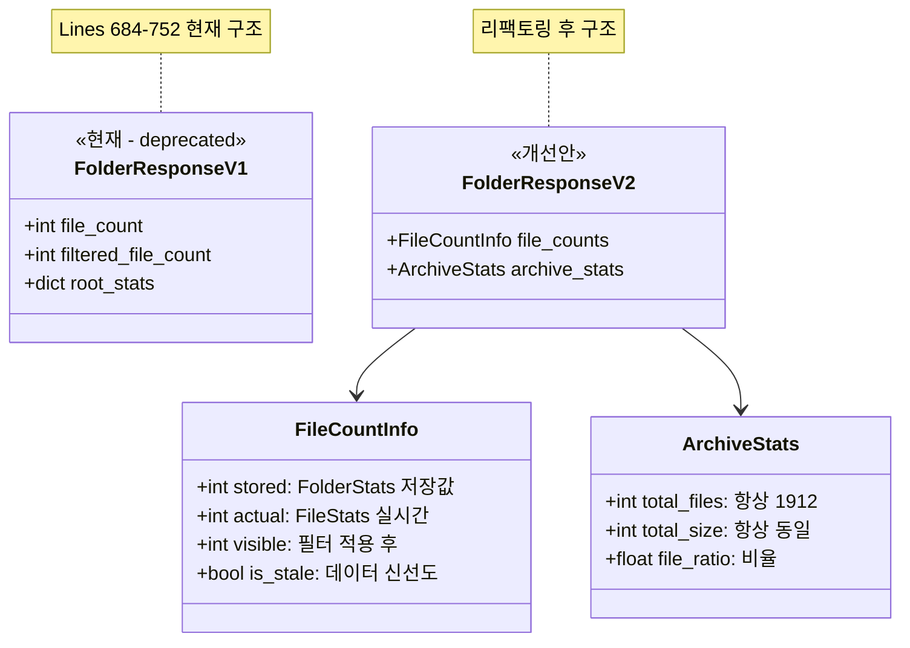

### 8.4 프론트엔드 변경 사항

```typescript
// MasterFolderTree/index.tsx - 변경 필요 위치

// Before (현재)
interface FolderNode {
  file_count: number;              // stored
  filtered_file_count?: number;    // visible
  root_stats?: {
    total_files: number;           // 불일치 가능
  };
}

// After (개선)
interface FolderNode {
  // v2 필드 (권장)
  file_counts: {
    stored: number;
    actual: number;
    visible: number;
    is_stale: boolean;
  };
  archive_stats: {
    total_files: number;  // 항상 일관됨
    total_size: number;
  };

  // v1 필드 (호환성, deprecated)
  file_count: number;
  filtered_file_count?: number;
  root_stats?: { ... };
}
```

---

## 9. 성능 영향 분석

### 9.1 쿼리 성능 비교

| 작업 | 현재 쿼리 수 | 개선 후 쿼리 수 | 예상 변화 |
|------|------------|---------------|----------|
| 초기 로드 (100폴더) | 100 (filtered_file_count) | 101 (archive 1회 + folder별) | +1% |
| Lazy Load (20폴더) | 20 | 21 | +5% |
| archive_stats 캐시 적용 시 | - | 0 (캐시 히트) | -50% |

### 9.2 인덱스 요구사항

```sql
-- 필수 인덱스 (folder_path prefix 검색 최적화)
CREATE INDEX IF NOT EXISTS idx_filestats_folder_path
ON file_stats(folder_path);

-- 복합 인덱스 (필터 조건 최적화)
CREATE INDEX IF NOT EXISTS idx_filestats_folder_name
ON file_stats(folder_path, name);

-- 확장자 필터 최적화
CREATE INDEX IF NOT EXISTS idx_filestats_extension
ON file_stats(extension);
```

### 9.3 벤치마크 기준

| 데이터 규모 | 현재 응답 시간 | 목표 응답 시간 |
|------------|--------------|--------------|
| 1,000 파일 | ~50ms | ~50ms |
| 10,000 파일 | ~200ms | ~150ms |
| 100,000 파일 | ~1.5s | ~800ms |

---

## 10. 테스트 계획

### 10.1 Unit Tests

```python
# tests/test_archive_stats.py

class TestArchiveStats:
    """_calculate_archive_stats() 단위 테스트"""

    async def test_always_returns_same_value(self, db_session):
        """path와 무관하게 항상 동일한 값 반환"""
        service = ProgressService()

        # 여러 번 호출해도 동일한 값
        result1 = await service._calculate_archive_stats(db_session)
        result2 = await service._calculate_archive_stats(db_session)

        assert result1["total_files"] == result2["total_files"]
        assert result1["total_size"] == result2["total_size"]

    async def test_sums_depth_zero_folders(self, db_session):
        """depth=0 폴더들의 합계 계산 검증"""
        # Given: depth=0 폴더 2개 (file_count: 100, 200)
        # When: _calculate_archive_stats() 호출
        # Then: total_files = 300


class TestFolderFileCounts:
    """_calculate_folder_file_counts() 단위 테스트"""

    async def test_actual_count_ignores_filters(self, db_session):
        """actual_count는 필터와 무관하게 전체 파일 수"""
        result = await service._calculate_folder_file_counts(
            db_session, "/test/folder", extensions=[".mp4"]
        )
        # actual_count는 .mp4 외 파일도 포함

    async def test_visible_count_applies_filters(self, db_session):
        """visible_count는 필터 적용 후 파일 수"""
        result = await service._calculate_folder_file_counts(
            db_session, "/test/folder", include_hidden=False
        )
        # visible_count는 숨김 파일 제외

    async def test_visible_lte_actual(self, db_session):
        """visible_count <= actual_count 항상 성립"""
        result = await service._calculate_folder_file_counts(...)
        assert result["visible_file_count"] <= result["actual_file_count"]
```

### 10.2 Integration Tests

```typescript
// frontend/tests/e2e/api/folder-stats-v2.spec.ts

test.describe('Folder Stats V2 API', () => {
  test('archive_stats consistent across lazy loads', async ({ request }) => {
    // 초기 로드
    const initial = await request.get('/api/progress/tree?depth=1');
    const initialArchiveTotal = initial.root_stats.total_files;

    // Lazy load (다른 path)
    const lazy = await request.get('/api/progress/tree?path=/WSOP&depth=1');
    const lazyArchiveTotal = lazy.tree[0].archive_stats.total_files;

    // 핵심: 항상 동일해야 함
    expect(lazyArchiveTotal).toBe(initialArchiveTotal);
  });

  test('file_counts.is_stale reflects data freshness', async ({ request }) => {
    const response = await request.get('/api/progress/tree?depth=2');

    for (const folder of response.tree) {
      if (folder.file_counts.is_stale) {
        // stored != actual 검증
        expect(folder.file_counts.stored).not.toBe(folder.file_counts.actual);
      }
    }
  });

  test('backward compatibility with v1 fields', async ({ request }) => {
    const response = await request.get('/api/progress/tree?depth=1');
    const folder = response.tree[0];

    // v1 필드 존재 확인 (deprecated)
    expect(folder.file_count).toBeDefined();
    expect(folder.filtered_file_count).toBeDefined();

    // v2 필드 존재 확인 (신규)
    expect(folder.file_counts).toBeDefined();
    expect(folder.archive_stats).toBeDefined();
  });
});
```

### 10.3 E2E Tests

```typescript
// frontend/tests/e2e/ui/folder-stats-display-v2.spec.ts

test('folder displays correct stats after lazy load', async ({ page }) => {
  await page.goto('/folders');

  // 초기 표시값 기록
  const initialTotal = await page.locator('[data-testid="archive-total"]').textContent();

  // 폴더 확장 (lazy load 트리거)
  await page.click('[data-testid="folder-WSOP"]');
  await page.waitForResponse('**/api/progress/tree**');

  // 확장 후에도 전체 총계 동일
  const afterTotal = await page.locator('[data-testid="archive-total"]').textContent();
  expect(afterTotal).toBe(initialTotal);
});
```

---

## 11. 캐싱 전략

### 11.1 캐시 설계

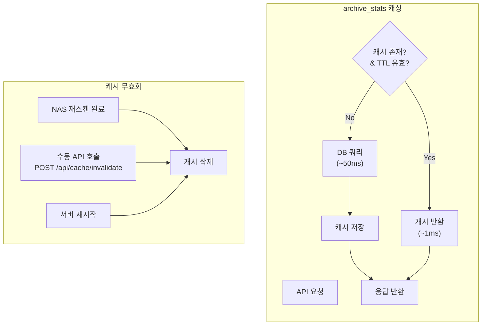

### 11.2 캐시 구현

```python
# backend/app/services/progress_service.py

from functools import lru_cache
from datetime import datetime, timedelta

class ProgressService:
    # 클래스 레벨 캐시
    _archive_stats_cache: Optional[Dict] = None
    _archive_stats_cached_at: Optional[datetime] = None
    _CACHE_TTL_SECONDS = 300  # 5분

    async def _calculate_archive_stats(self, db: AsyncSession) -> Dict[str, Any]:
        """전체 아카이브 통계 (캐시 적용)"""

        # 캐시 히트 체크
        if self._is_cache_valid():
            return self._archive_stats_cache

        # 캐시 미스: DB 쿼리
        stats = await self._fetch_archive_stats_from_db(db)

        # 캐시 저장
        self._archive_stats_cache = stats
        self._archive_stats_cached_at = datetime.now()

        return stats

    def _is_cache_valid(self) -> bool:
        """캐시 유효성 검사"""
        if self._archive_stats_cache is None:
            return False
        if self._archive_stats_cached_at is None:
            return False

        elapsed = datetime.now() - self._archive_stats_cached_at
        return elapsed < timedelta(seconds=self._CACHE_TTL_SECONDS)

    def invalidate_cache(self):
        """캐시 수동 무효화 (NAS 스캔 후 호출)"""
        self._archive_stats_cache = None
        self._archive_stats_cached_at = None
```

### 11.3 캐시 무효화 트리거

| 이벤트 | 무효화 방법 | 자동/수동 |
|--------|-----------|----------|
| NAS 스캔 완료 | `scan_service.scan()` 후 `invalidate_cache()` 호출 | 자동 |
| 서버 재시작 | 클래스 인스턴스 초기화 | 자동 |
| 수동 요청 | `POST /api/admin/cache/invalidate` | 수동 |
| TTL 만료 | 5분 후 자동 재조회 | 자동 |

---

## 12. 롤백 계획

### 12.1 Phase별 롤백 절차

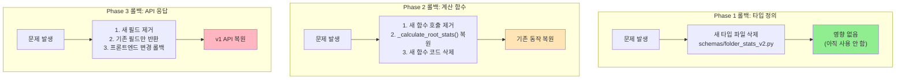

### 12.2 롤백 체크리스트

#### Phase 3 롤백 (가장 위험)

```bash
# 1. 프론트엔드 롤백
cd frontend
git checkout HEAD~1 -- src/components/MasterFolderTree/index.tsx
git checkout HEAD~1 -- src/types/index.ts

# 2. 백엔드 롤백
cd ../backend
git checkout HEAD~1 -- app/services/progress_service.py
git checkout HEAD~1 -- app/api/progress.py

# 3. Docker 재배포
docker-compose down && docker-compose up -d --build

# 4. 검증
curl http://localhost:8082/api/progress/tree?depth=1 | jq '.tree[0] | keys'
# 예상 출력: ["file_count", "filtered_file_count", "root_stats", ...]
# (새 필드 없어야 함)
```

### 12.3 롤백 판단 기준

| 증상 | 심각도 | 롤백 결정 |
|------|--------|----------|
| API 응답 시간 2배 이상 증가 | HIGH | 즉시 롤백 |
| `archive_stats` 값 불일치 | HIGH | 즉시 롤백 |
| 프론트엔드 렌더링 오류 | MEDIUM | 원인 분석 후 결정 |
| `is_stale` 오탐 | LOW | 핫픽스로 대응 |

### 12.4 롤백 연락망

```
1. 문제 감지 → Slack #archive-alerts 알림
2. 심각도 판단 → 개발자 호출
3. 롤백 결정 → 팀 리드 승인
4. 롤백 실행 → DevOps 또는 개발자
5. 사후 분석 → 원인 문서화
```

---

## 변경 이력

| 버전 | 날짜 | 변경 |
|------|------|------|
| 1.2.0 | 2025-12-13 | 성능 분석, 테스트 계획, 캐싱 전략, 롤백 계획 추가 (Section 9-12) |
| 1.1.0 | 2025-12-13 | 실제 코드 블록 분석 섹션 추가 (Section 8) |
| 1.0.0 | 2025-12-13 | 초기 설계 문서 작성 |
