# Archive Statistics Dashboard - UI Mockup

## 1. 전체 화면 레이아웃

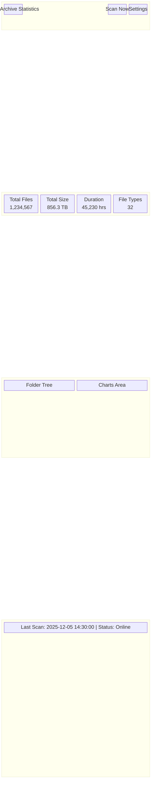

---

## 2. 메인 대시보드 상세

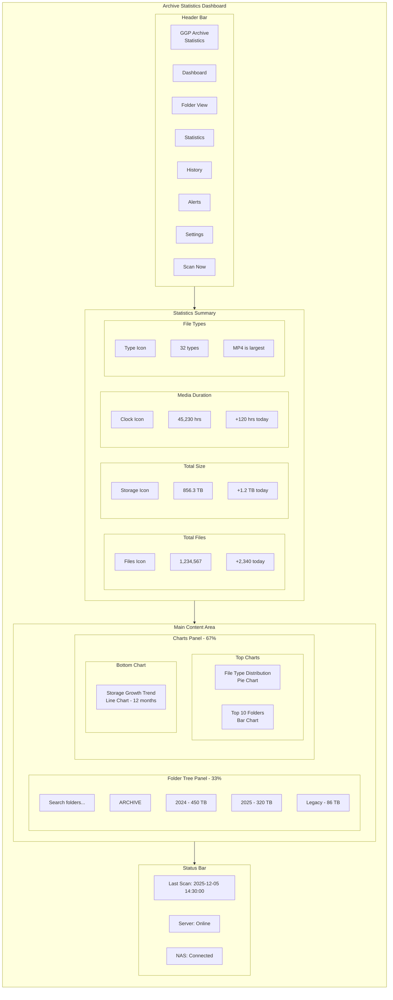

---

## 3. 폴더 트리 뷰 (상세)

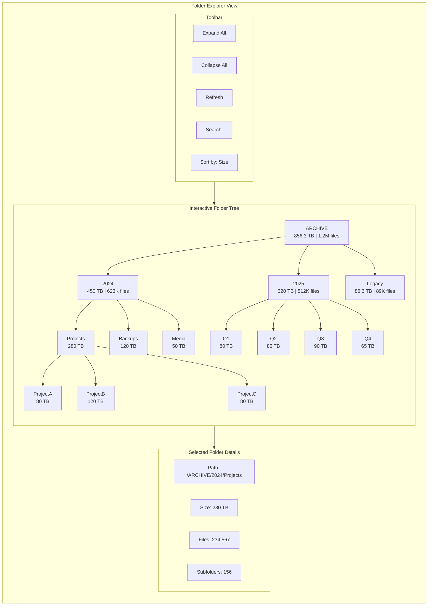

---

## 4. 통계 차트 영역

### 4.1 파일 형식별 분포 (Pie Chart)

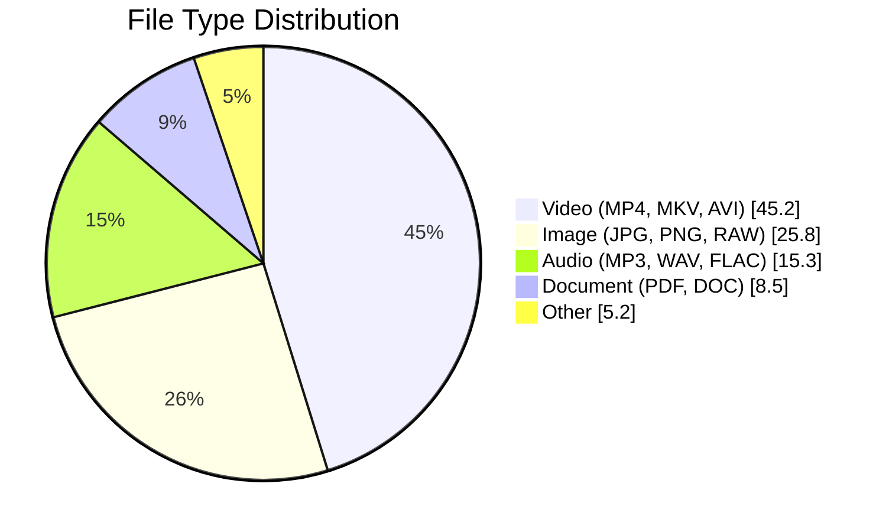

### 4.2 월별 용량 추이 (Line Chart)

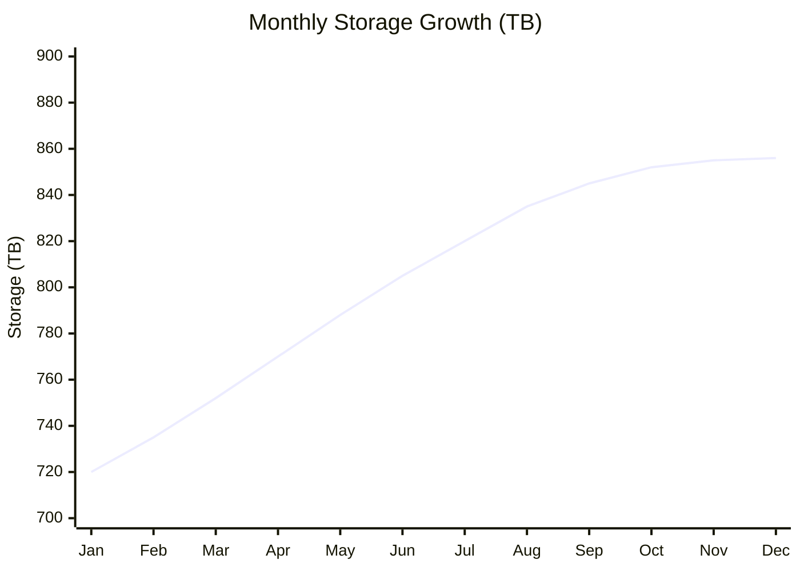

### 4.3 폴더별 용량 Top 10 (Bar Chart - 개념)

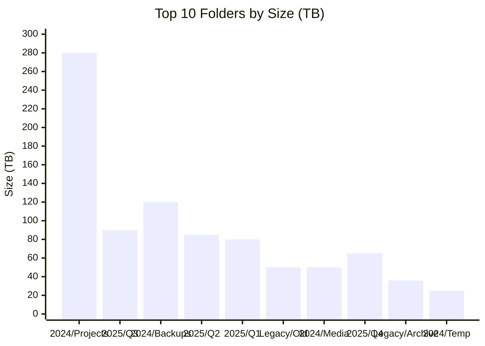

---

## 5. 폴더 트리맵 시각화

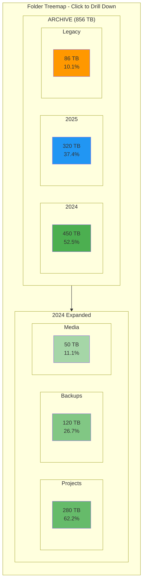

---

## 6. 알림 설정 페이지

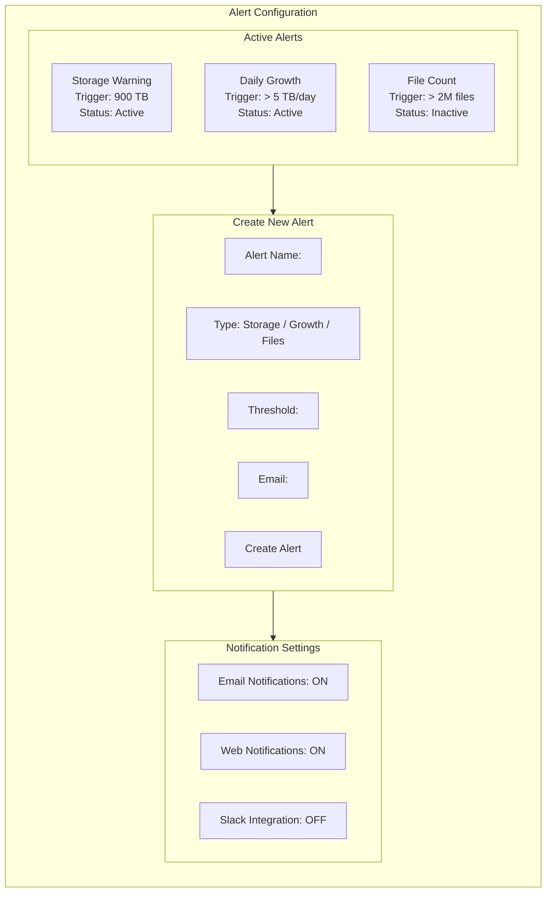

---

## 7. 스캔 진행 모달

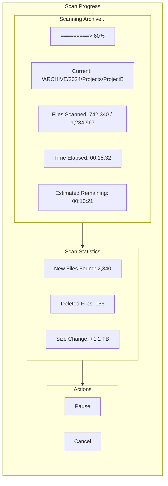

---

## 8. 히스토리 페이지

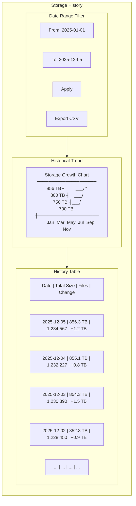

---

## 9. 아카이빙 작업 현황 관리 페이지 (Work Status Tracker)

### 9.1 작업 현황 대시보드

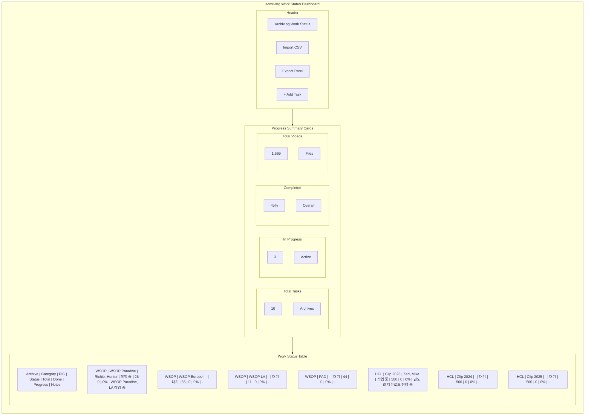

### 9.2 아카이브별 진행률 차트

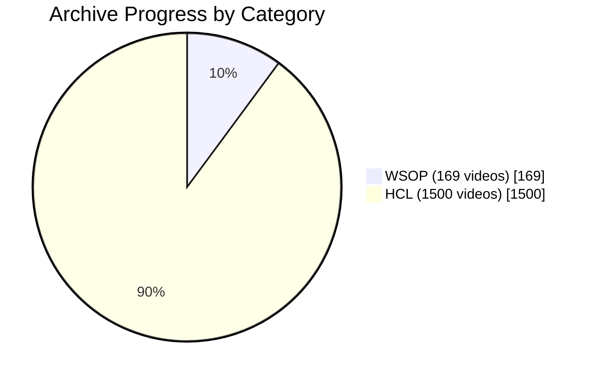

### 9.3 담당자(PIC)별 작업 현황

```mermaid
xychart-beta
    title "Work Status by PIC"
    x-axis ["Richie/Hunter", "Zed/Mike", "Unassigned"]
    y-axis "Number of Videos" 0 --> 1600
    bar "Total" [26, 500, 1143]
    bar "Done" [0, 0, 0]
```

### 9.4 칸반 보드 스타일 뷰

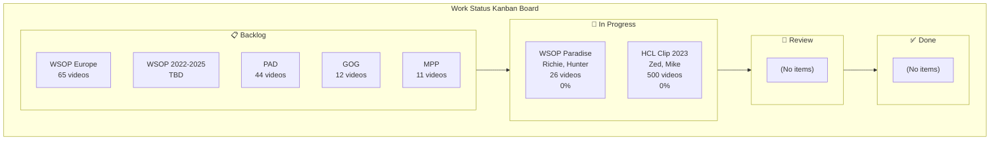

### 9.5 작업 상세 편집 모달

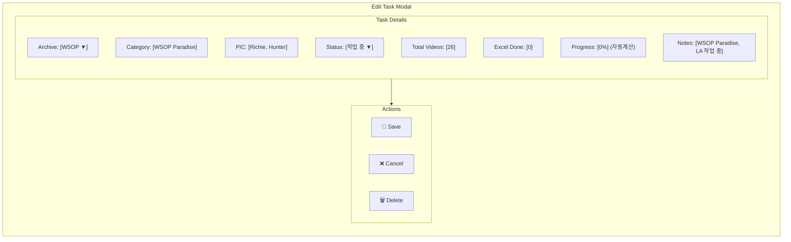

### 9.6 CSV Import 화면

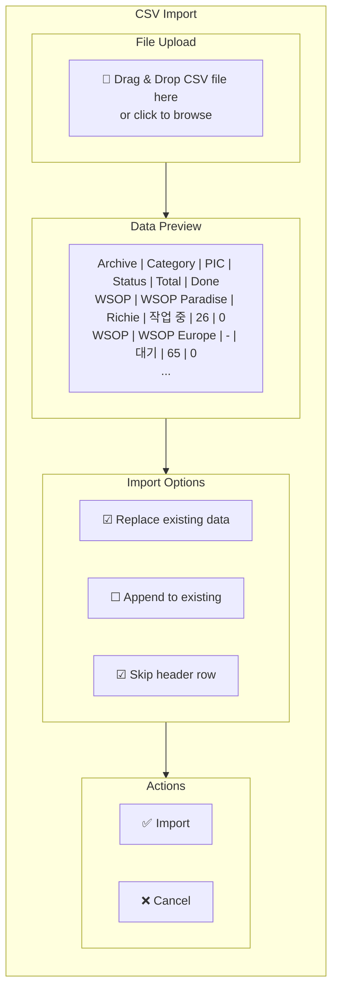

---

## 10. 반응형 레이아웃

### 10.1 Desktop (1920px+)

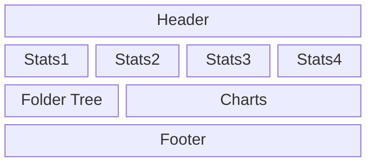

### 10.2 Tablet (768px - 1024px)

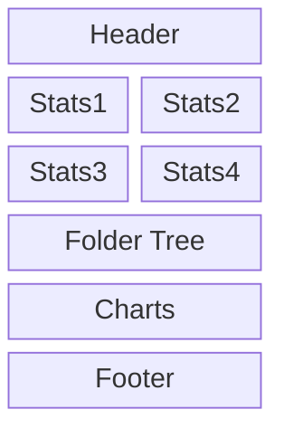

### 10.3 Mobile (< 768px)

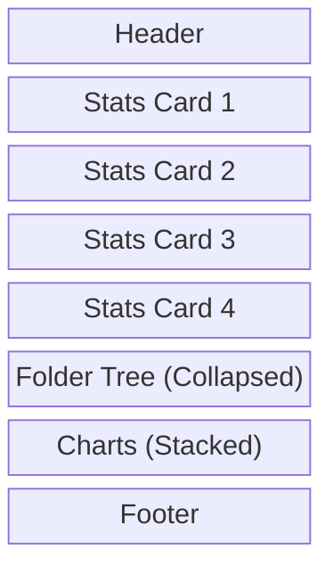

---

## 11. 컬러 스키마

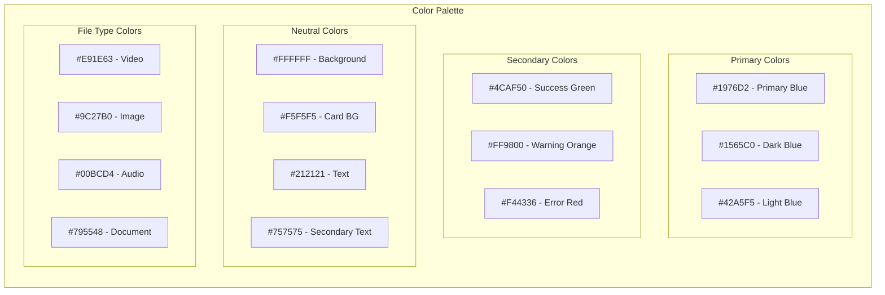

---

## 12. 사용자 흐름 (User Flow)

```mermaid
flowchart TD
    Start["User Opens App"] --> Dashboard["View Dashboard"]

    Dashboard --> ViewStats["View Statistics Cards"]
    Dashboard --> ViewTree["Explore Folder Tree"]
    Dashboard --> ViewCharts["Analyze Charts"]
    Dashboard --> StartScan["Start Manual Scan"]

    ViewTree --> SelectFolder["Select Folder"]
    SelectFolder --> FolderDetails["View Folder Details"]
    FolderDetails --> DrillDown["Drill Down Subfolders"]

    ViewCharts --> FilterData["Filter by Date/Type"]
    FilterData --> ExportData["Export Report"]

    StartScan --> ScanProgress["View Scan Progress"]
    ScanProgress --> ScanComplete["Scan Complete"]
    ScanComplete --> Dashboard

    Dashboard --> SetAlerts["Configure Alerts"]
    SetAlerts --> AlertTriggered["Alert Triggered"]
    AlertTriggered --> ViewAlert["View Alert Details"]
    ViewAlert --> Dashboard

    Dashboard --> WorkStatus["Manage Work Status"]
    WorkStatus --> ImportCSV["Import CSV Data"]
    WorkStatus --> EditTask["Edit Task Progress"]
    WorkStatus --> ViewKanban["View Kanban Board"]
    EditTask --> UpdateProgress["Update Progress %"]
    UpdateProgress --> WorkStatus
```

---

## 13. 컴포넌트 구조

```mermaid
flowchart TB
    subgraph Components["React Component Structure"]
        App["App.tsx"]

        App --> Layout["Layout.tsx"]

        Layout --> Header["Header.tsx"]
        Layout --> Sidebar["Sidebar.tsx"]
        Layout --> Main["MainContent.tsx"]
        Layout --> Footer["Footer.tsx"]

        Main --> Dashboard["DashboardPage.tsx"]
        Main --> FolderView["FolderViewPage.tsx"]
        Main --> WorkStatus["WorkStatusPage.tsx"]
        Main --> History["HistoryPage.tsx"]
        Main --> Alerts["AlertsPage.tsx"]
        Main --> Settings["SettingsPage.tsx"]

        WorkStatus --> StatusTable["StatusTable.tsx"]
        WorkStatus --> KanbanBoard["KanbanBoard.tsx"]
        WorkStatus --> CSVImport["CSVImport.tsx"]

        Dashboard --> StatCards["StatCards.tsx"]
        Dashboard --> FolderTree["FolderTree.tsx"]
        Dashboard --> ChartPanel["ChartPanel.tsx"]

        ChartPanel --> PieChart["PieChart.tsx"]
        ChartPanel --> LineChart["LineChart.tsx"]
        ChartPanel --> BarChart["BarChart.tsx"]

        FolderTree --> TreeNode["TreeNode.tsx"]
        FolderTree --> TreeSearch["TreeSearch.tsx"]
    end
```

---

**이 문서는 Archive Statistics Dashboard의 UI/UX 설계를 Mermaid 다이어그램으로 시각화한 것입니다.**
