# PRD: Archive Statistics Dashboard

**Version**: 1.2
**Date**: 2025-12-05
**Author**: GGP Team
**Status**: In Development

## Changelog
| Version | Date | Changes |
|---------|------|---------|
| 1.2 | 2025-12-05 | Added real-time features: viewer count, scan logs sharing, smart duration caching |
| 1.1 | 2025-12-05 | Added Work Status Tracker feature |
| 1.0 | 2025-12-05 | Initial PRD |

---

## 1. 개요 (Purpose)

1페타바이트 규모의 아카이브 저장소에 대한 통계 정보를 실시간으로 모니터링하고 관리할 수 있는 웹 기반 대시보드 솔루션.

### 1.1 배경
- **대상 저장소**: `\\10.10.100.122\docker\GGPNAs\ARCHIVE`
- **총 용량**: ~1 PB (페타바이트)
- **목적**: 아카이브 파일의 수량, 용량, 재생시간, 형식 등을 상시 모니터링

### 1.2 핵심 가치
- 대용량 아카이브의 현황을 한눈에 파악
- 파일 형식별, 날짜별 통계 분석
- 폴더 트리 구조 시각화로 직관적 탐색
- 용량 증가 추이 모니터링 및 알림

---

## 2. 대상 사용자 (Target Users)

| 구분 | 역할 | 주요 사용 목적 |
|------|------|----------------|
| Primary | GGP 팀 전체 | 아카이브 현황 모니터링, 통계 확인 |
| Secondary | 아카이브 관리자 | 상세 분석, 알림 설정 |

---

## 3. 오픈소스 솔루션 검토 (Open Source Solutions)

### 3.1 추천 솔루션 비교표

| 솔루션 | 유형 | 장점 | 단점 | 추천도 |
|--------|------|------|------|--------|
| **FileBrowser** | 파일 관리 | 가볍고 빠름, Docker 지원, 웹 UI | 통계 기능 제한적 | ⭐⭐⭐⭐ |
| **Grafana + Prometheus** | 모니터링 | 강력한 시각화, 알림 기능 | 설정 복잡, 별도 수집기 필요 | ⭐⭐⭐⭐⭐ |
| **Netdata** | 모니터링 | 실시간, 쉬운 설정, 상세 메트릭 | 파일 분석 기능 없음 | ⭐⭐⭐ |
| **Diskover** | 디스크 분석 | 웹 UI, Elasticsearch 연동 | 설정 복잡, 리소스 사용 높음 | ⭐⭐⭐ |
| **OpenList (AList Fork)** | 파일 목록 | 다중 저장소, 모던 UI | 통계 기능 제한적 | ⭐⭐⭐ |

### 3.2 권장 구성: 하이브리드 접근

**Option A: 커스텀 개발 (권장)**
- Frontend: React/Vue + Chart.js/Recharts
- Backend: Python FastAPI + SQLite
- 장점: 요구사항에 맞춤 개발, 폴더 트리 뷰 구현 자유도

**Option B: FileBrowser + Grafana 조합**
- [FileBrowser](https://filebrowser.org/) - 파일 탐색 및 관리
- [Grafana](https://grafana.com/) - 통계 시각화 대시보드
- 커스텀 수집기 - 파일 메타데이터 수집

**Option C: Diskover Enterprise (오픈소스 버전)**
- [Diskover](https://github.com/diskoverdata/diskover-community) - 파일 시스템 크롤러
- Elasticsearch 기반 검색 및 분석

### 3.3 참고 리소스
- [FileBrowser GitHub](https://github.com/filebrowser/filebrowser) - v2.49.0 (2025-11)
- [Grafana Labs](https://grafana.com/) - 오픈소스 시각화 플랫폼
- [Netdata](https://www.netdata.cloud/) - 실시간 모니터링
- [OpenList](https://github.com/OpenListTeam/OpenList) - AList 커뮤니티 포크

---

## 4. 핵심 기능 (Core Features)

### 4.1 파일 분석 대시보드
**Description**: 아카이브 내 파일에 대한 종합 통계 표시
**Priority**: High
**Effort**: Medium
**Status**: ✅ Implemented

**세부 기능**:
- 총 파일 수 표시 ✅
- 총 저장 용량 표시 (TB/PB 단위) ✅
- 총 재생시간 표시 (미디어 파일) ✅
- 파일 형식별 분포 차트 ✅

### 4.2 폴더 트리 구조 뷰
**Description**: 아카이브 폴더 구조를 트리맵/트리뷰로 시각화
**Priority**: High
**Effort**: High
**Status**: ✅ Implemented

**세부 기능**:
- 인터랙티브 폴더 트리 뷰 ✅
- 폴더별 용량 크기 표시 ✅
- 폴더 클릭 시 하위 구조 탐색 ✅
- 폴더별 파일 수 및 용량 통계 ✅
- Top Folders by Size 차트 ✅

### 4.3 파일 형식별 분석
**Description**: 파일 확장자/타입별 상세 통계
**Priority**: High
**Effort**: Low
**Status**: ✅ Implemented

**세부 기능**:
- 확장자별 파일 수 및 용량 ✅
- 미디어 타입별 분류 (Video, Audio, Image, Document, etc.) ✅
- 파이 차트 시각화 ✅

### 4.4 수동 스캔 기능
**Description**: 사용자가 필요 시 아카이브 스캔 실행
**Priority**: High
**Effort**: Medium
**Status**: ✅ Implemented

**세부 기능**:
- "스캔 시작" 버튼으로 수동 트리거
- 스캔 진행률 표시
- 마지막 스캔 시간 표시
- 스캔 히스토리 로그

### 4.4.1 실시간 스캔 상태 공유 ⭐ NEW (v1.2)
**Description**: 다중 클라이언트 간 스캔 상태 실시간 공유
**Priority**: High
**Effort**: Medium
**Status**: ✅ Implemented

**세부 기능**:
- 모든 접속 클라이언트에게 스캔 진행률 실시간 공유
- 스캔 로그 실시간 표시 (Show Logs 버튼)
- 미디어 파일 처리 현황 표시 (처리된 미디어 파일 수)
- 예상 남은 시간 표시

### 4.4.2 스마트 스캔 최적화 ⭐ NEW (v1.2)
**Description**: 이미 분석된 파일 중복 처리 방지
**Priority**: High
**Effort**: Low
**Status**: ✅ Implemented

**세부 기능**:
- 이미 재생시간이 분석된 미디어 파일은 재분석 건너뛰기
- ffprobe 타임아웃 최적화 (10초)
- probesize/analyzeduration 제한으로 빠른 분석

### 4.4.3 현재 접속자 수 표시 ⭐ NEW (v1.2)
**Description**: 현재 대시보드를 보고 있는 사용자 수 표시
**Priority**: Medium
**Effort**: Low
**Status**: ✅ Implemented

**세부 기능**:
- 푸터에 "X viewers online" 표시
- 클라이언트 ID 기반 사용자 추적
- 30초 이상 응답 없는 클라이언트 자동 정리

### 4.5 히스토리 추적
**Description**: 시간에 따른 변화 추이 그래프
**Priority**: Medium
**Effort**: Medium
**Status**: ✅ Implemented

**세부 기능**:
- 일별/주별/월별 용량 변화 그래프 ✅
- Storage Growth Trend 차트 ✅
- 파일 수 변화 추이 🔄 (진행 중)

### 4.6 대시보드 알림
**Description**: 임계치 도달 시 알림 기능
**Priority**: Medium
**Effort**: Medium
**Status**: 📋 Planned

**세부 기능**:
- 용량 임계치 설정 (예: 900TB 도달 시)
- 이메일/웹 알림
- 급격한 변화 감지 알림

### 4.7 아카이빙 작업 현황 관리 (Work Status Tracker)
**Description**: 아카이빙 작업 진행 상황을 추적하고 관리하는 기능
**Priority**: High
**Effort**: Medium
**Status**: ✅ Implemented

**세부 기능**:
- CSV/Excel 파일 Import/Export ✅
- 작업 현황 테이블 뷰 ✅
- 담당자(PIC)별 필터링 ✅
- Archive별 분류 ✅
- CRUD 작업 지원 ✅

**데이터 구조** (현재 운영 중인 시트 기반):

| 필드 | 설명 | 예시 |
|------|------|------|
| Archive | 아카이브 대분류 | WSOP, HCL |
| Category | 세부 카테고리 | WSOP Paradise, Clip 2023 |
| PIC | 담당자 | Richie, Zed |
| Status | 작업 상태 | 작업 중, 완료, 대기 |
| Total (# of videos) | 총 비디오 수 | 500 |
| Excel Done | 완료된 수 | 250 |
| Progress % | 진행률 | 50% |
| Notes | 비고 | 다운로드 완료 후 MAM 입력 예정 |

**현재 아카이브 목록**:
- **WSOP**: WSOP Paradise, WSOP Europe, WSOP 2022-2025, WSOP LA, PAD, GOG, MPP
- **HCL**: Clip 2023, Clip 2024, Clip 2025

---

## 5. 기술 요구사항 (Technical Requirements)

### 5.1 네트워크 접근
- **저장소 경로**: `\\10.10.100.122\docker\GGPNAs\ARCHIVE`
- **인증 정보**:
  - ID: `GGP`
  - Password: `!@QW12qw`
- **프로토콜**: SMB/CIFS

### 5.2 아키텍처

### 5.3 성능 요구사항
- 대시보드 로딩: < 3초
- 스캔 처리: 점진적 스캔 (전체 스캔 시 백그라운드 처리)
- 동시 사용자: 10명 이상 지원

### 5.4 데이터 저장
- 스캔 결과 캐싱 (DB 저장)
- 히스토리 데이터 보관 (최소 1년)
- 일일 스냅샷 저장

---

## 6. UI/UX 디자인

### 6.1 전체 레이아웃 구조

```mermaid
block-beta
    columns 3

    Header["Archive Statistics Dashboard"]:3

    space:3

    StatCard1["📁 파일 수<br/>1.2M"]:1
    StatCard2["💾 총 용량<br/>856 TB"]:1
    StatCard3["⏱️ 재생시간<br/>45,000h"]:1

    space:3

    TreeView["📂 폴더 트리 뷰"]:1
    Charts["📊 차트 영역"]:2

    space:3

    Footer["마지막 스캔: 2025-12-05 14:30 | 상태: 정상"]:3
```

### 6.2 메인 대시보드 와이어프레임

```mermaid
flowchart TB
    subgraph Header["🏠 Archive Statistics Dashboard"]
        Logo["GGP Archive"]
        ScanBtn["🔄 Scan Now"]
        Settings["⚙️"]
    end

    subgraph Stats["📊 통계 카드"]
        direction LR
        S1["📁 파일 수<br/>1,234,567"]
        S2["💾 총 용량<br/>856.3 TB"]
        S3["⏱️ 재생시간<br/>45,230 hrs"]
        S4["📋 형식 수<br/>32 types"]
    end

    subgraph MainContent["메인 컨텐츠"]
        direction LR
        subgraph TreePanel["폴더 트리"]
            T1["📁 ARCHIVE/"]
            T2["  📁 2024/"]
            T3["    📁 Projects/"]
            T4["  📁 2025/"]
        end

        subgraph ChartPanel["차트"]
            Pie["🥧 파일 형식 분포"]
            Line["📈 용량 추이"]
        end
    end

    subgraph Footer["푸터"]
        LastScan["마지막 스캔: 2025-12-05 14:30"]
        Status["상태: ✅ 정상"]
    end

    Header --> Stats
    Stats --> MainContent
    MainContent --> Footer
```

### 6.3 폴더 트리맵 뷰

```mermaid
flowchart TB
    subgraph Treemap["📊 폴더별 용량 트리맵"]
        direction TB

        subgraph Row1["ARCHIVE (856 TB)"]
            direction LR
            A1["📁 2024<br/>450 TB<br/>52.5%"]
            A2["📁 2025<br/>320 TB<br/>37.4%"]
            A3["📁 Legacy<br/>86 TB<br/>10.1%"]
        end

        subgraph Row2["2024 상세"]
            direction LR
            B1["Projects<br/>280 TB"]
            B2["Backups<br/>120 TB"]
            B3["Media<br/>50 TB"]
        end
    end

    Row1 --> Row2
```

### 6.4 상세 폴더 트리 컴포넌트

```mermaid
flowchart LR
    subgraph FolderTree["Interactive Folder Tree"]
        Root["📁 ARCHIVE"]
        Root --> Y2024["📁 2024 (450 TB)"]
        Root --> Y2025["📁 2025 (320 TB)"]
        Root --> Legacy["📁 Legacy (86 TB)"]

        Y2024 --> Proj["📁 Projects (280 TB)"]
        Y2024 --> Back["📁 Backups (120 TB)"]

        Proj --> ProjA["📁 ProjectA (80 TB)"]
        Proj --> ProjB["📁 ProjectB (120 TB)"]
        Proj --> ProjC["📁 ProjectC (80 TB)"]
    end
```

### 6.5 차트 컴포넌트

```mermaid
pie title 파일 형식별 분포
    "Video (MP4, MKV)" : 45
    "Image (JPG, PNG)" : 25
    "Audio (MP3, WAV)" : 15
    "Document (PDF)" : 10
    "Other" : 5
```

### 6.6 용량 추이 그래프 (개념)

```mermaid
xychart-beta
    title "월별 저장 용량 추이 (TB)"
    x-axis [Jan, Feb, Mar, Apr, May, Jun, Jul, Aug, Sep, Oct, Nov, Dec]
    y-axis "용량 (TB)" 0 --> 900
    line [720, 735, 750, 768, 785, 800, 815, 830, 840, 850, 855, 856]
```

### 6.7 페이지 네비게이션

```mermaid
flowchart LR
    subgraph Navigation["📑 메뉴"]
        Home["🏠 대시보드"]
        Tree["📂 폴더 구조"]
        Stats["📊 통계"]
        History["📈 히스토리"]
        Alerts["🔔 알림"]
        Settings["⚙️ 설정"]
    end

    Home --> Tree
    Tree --> Stats
    Stats --> History
    History --> Alerts
    Alerts --> Settings
```

---

## 7. 성공 지표 (Success Metrics)

| 지표 | 목표 | 측정 방법 |
|------|------|-----------|
| 대시보드 로딩 시간 | < 3초 | 페이지 로드 시간 측정 |
| 스캔 정확도 | 99.9% | 샘플 검증 |
| 사용자 만족도 | > 4.0/5.0 | 팀 피드백 |
| 시스템 가용성 | 99% | 업타임 모니터링 |

---

## 8. 범위 외 항목 (Out of Scope)

- 파일 내용 검색/인덱싱
- 파일 직접 다운로드/스트리밍
- 파일 삭제/이동 기능
- 다중 저장소 지원 (v1.0)

---

## 9. 일정 (Timeline)

| Phase | 작업 | 산출물 |
|-------|------|--------|
| 0 | 요구사항 분석 | PRD (본 문서) |
| 0.5 | 태스크 분해 | Task List |
| 1 | 구현 | Backend + Frontend |
| 2 | 테스트 | 테스트 리포트 |
| 2.5 | 코드 리뷰 | 승인 |
| 3 | 버전 관리 | CHANGELOG |
| 4 | Git Ops | PR |
| 5 | E2E 테스트 | 보안 리포트 |
| 6 | 배포 | 운영 환경 |

---

## 10. 위험 요소 (Risks)

| 위험 | 영향 | 완화 방안 |
|------|------|-----------|
| 대용량 스캔 시간 | High | 점진적 스캔, 캐싱 |
| 네트워크 지연 | Medium | 로컬 캐시, 비동기 처리 |
| NAS 접근 권한 | High | 사전 권한 확인 |
| 폴더 트리 렌더링 성능 | Medium | 가상화 스크롤, 레이지 로딩 |

---

## 11. 부록 (Appendix)

### 11.1 예상 파일 형식
- Video: MP4, MKV, AVI, MOV, WMV
- Audio: MP3, WAV, FLAC, AAC
- Image: JPG, PNG, GIF, TIFF, RAW
- Document: PDF, DOC, XLS, PPT

### 11.2 관련 문서
- 네트워크 구성도
- NAS 관리 가이드

### 11.3 참고 오픈소스 프로젝트
- [FileBrowser](https://github.com/filebrowser/filebrowser) - 웹 파일 관리자
- [Grafana](https://grafana.com/) - 시각화 대시보드
- [Diskover](https://github.com/diskoverdata/diskover-community) - 파일 시스템 분석
- [Netdata](https://www.netdata.cloud/) - 실시간 모니터링
- [OpenList](https://github.com/OpenListTeam/OpenList) - 다중 저장소 파일 목록

---

**Next Steps**: `/todo` 명령어로 태스크 리스트 생성

---

## Sources

- [FileBrowser GitHub](https://github.com/filebrowser/filebrowser)
- [Grafana Labs](https://grafana.com/)
- [Top 10 Open Source Monitoring Tools 2025](https://openobserve.ai/blog/top-10-open-source-monitoring-tools-2025/)
- [5 Open Source Dashboards for NAS Monitoring](https://www.xda-developers.com/open-source-dashboards-nas-monitoring-fun/)
- [OpenList (AList Fork)](https://github.com/OpenListTeam/OpenList)
- [Diskover Community](https://github.com/diskoverdata/diskover-community)
